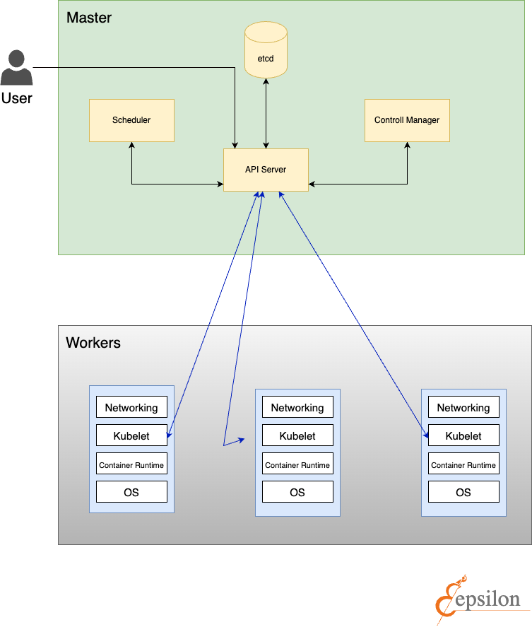

# Kubernetes internals

Chiunque abbiamo seguito un tutorial su Kubernetes ha lanciato il comando
```kubectl run nginx-pod --image=nginx:latest```

E ha potuto ammirare soddisfatto il pod in esecuzione all'interno del cluster Kubernetes.
A questo punti alcuni hanno cambiato la descrizione del profilo Linkedin in "Kubernetes Tech Lead Engineer", altri hanno cominciato ad approfondire questo tool.
Ma cosa c'è dietro? Quale "magia" si cela dietro K8s affinchè quel pod possa esser "preso in carico" e avviato all'interno del cluster?

In questo articolo daremo una panoramica di quelli che sono gli attori coinvolti

Lavoreremo sotto le seguenti ipotesi:
- Avremo un nodo master e due nodi worker
- I pod non potranno essere schedulati sul nodo master
- Etcd sarà interno al cluster
- Il pod non necessiterà di essere esposto al di fuori del cluster
- Il pod non avrò bisogno di montare volumi

Saranno coinvolti i seguenti componenti:

1. **Api Server** che ci permette di interagire con il cluster tramite chiamate API. Possiamo vederlo come il front end del control plane di Kubernetes. È progettato per scalare orizzontalmente, cioè scala aumentando il numero di instanze. Possiamo eseguire multiple istanze di kube-apiserver e bilanciare il traffico tra queste istanze

2. **Scheduler** schedulerà ed allocherà i nostri pod sulle macchine worker. Controlla i pod appena creati che non hanno un nodo assegnato e, dopo averlo identificato, glielo assegna. I fattori presi in considerazioni nell'individuare un nodo a cui assegnare l'esecuzione di un Pod includono la richiesta di risorse del Pod stesso e degli altri workload presenti nel sistema, i vincoli delle hardware/software/policy, le indicazioni di affinity e di anti-affinity, requisiti relativi alla disponibilità di dati/volumi, le interferenze tra diversi workload e le scadenze

3. **Controller** sono diversi applicativi che vanno a verificare lo stato del cluster interagendo con l'API server e controllano lo stato del cluster confrontandolo con quello desiderato dall'utente. Nel caso in cui questi due stati non combacino, lo scheduler sarà responsabile di far convergere lo stato del cluster verso quello desiderato dall'utente

4. **etcd** è un archivio dati di tipo chiave valore distribuito e ridondato. Serve a mantenere lo stato del cluster.

5. **Kubelet** un agente che è eseguito su ogni nodo del cluster. Si assicura che i container siano eseguiti in un pod e comunica direttamente con l'api-server

7. **Kubectl** è il principale tool utilizzato per intaragire con il cluster Kubernetes. Lo fa autenticandosi sul control plane e facendo chiamate API di vario tipo.



Proviamo ora a ripercorrere gli step che ci portano dall'esecuzione del nostro comando fino all'effettivo avvio del container all'interno del cluster


##### 1. Lanciamo il comando

```kubectl run nginx-pod --image=nginx:latest```

##### 2 Kubectl si autentica sul cluster
##### 3. Kubectl effettua la chiamata API all'API Server
In questa fase il tool kubectl tradurrà il nostro comando in un'API di Kubernetes. Un concetto fondamentale da capire quando si lavora con Kubernetes è che tutto è un'API.
Anche quando applichiamo un manifest kubectl lo traduce in una chimata API e contatta l'api server.

Per esempio, supponendo di voler avere una lista di tutti i namespace presenti all'interno del cluster, possiamo lanciare il comando
```kubectl get namespaces```

o interrogare direttamente l'api-server con la chiamata 

```http://[control-plane-ip]:[PORT]/api/v1/namespaces```

Pri


4. L'API server valida il manifest
5. L'API server aggiorna lo stato di etcd
6. Un controller viene attivato e si accorge che lo stato presente in etcd non "matcha" con lo stato desidrato dall'utente
7. Questo "missmatch" tra stato attuale e stato desiderato attiva lo scheduler che deve decidere su quale dei nodi lanciare il pod
8. Deciso il nodo, le operazioni vengano affidate alla kubelet
9. La kubelet lancia il pod che contiene il container desiderato e contatta il control plane