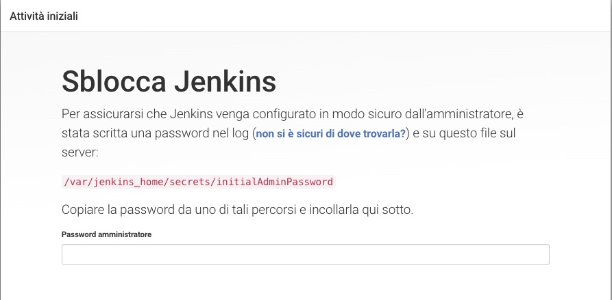
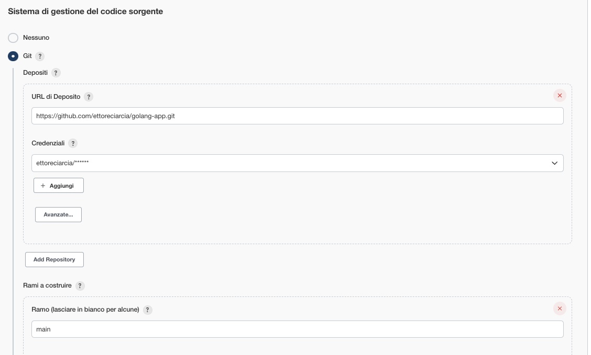
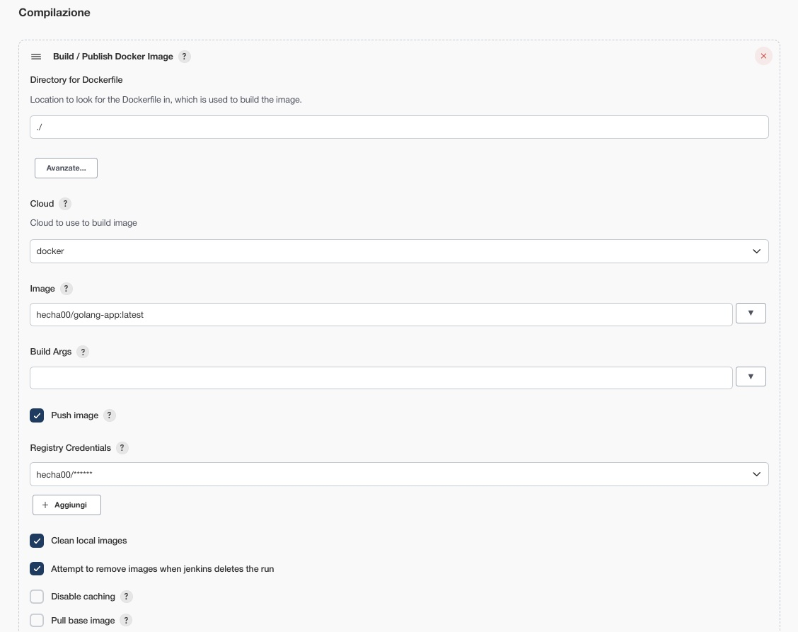
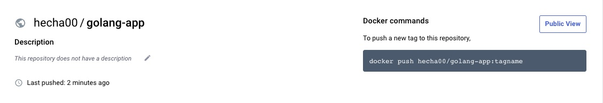
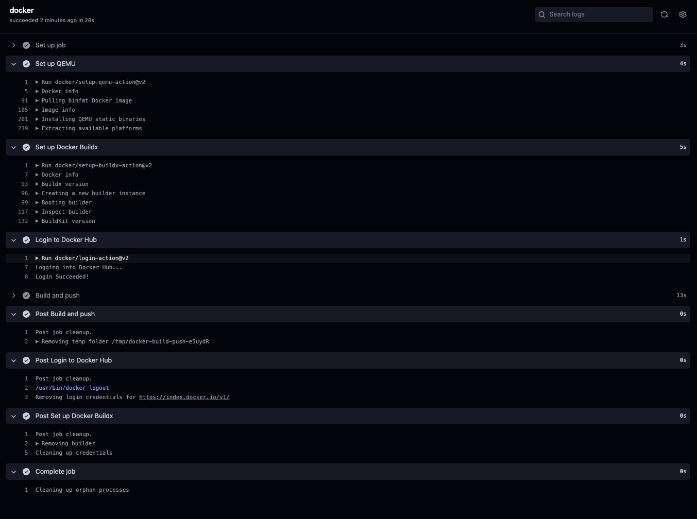

# Semplice applicazione Go e build automatiche con Jenkins/GH Actions

In questo articolo andremo a creare una semplice applicazione in golang che utilizzeremo per testare i service in Kubernetes.

Ma perché stiamo crendo un'applicazione da zero? Per mettere le mani in pasta con un po' di codice e magari approfittarne per fare una toccata e fuga su sistemi come Jenkins o le GitHub Pipeline

### 1 Applicazione

#### 1.1 Scopo dell'applicazione

La nostra applicazione non dovrà fare nulla di particolare, sarà un semplice webserver che risponderà ad un certo path con un json.

Nello specifico, l'applicazione che andremo a creare risponderà con un json strutturato in questo modo:

```json
{
    "hostname": "170e800c2068",
    "message": "Status Created",
    "value": "8",
    "version": "1"
}
```

- **hostname** : un valore che ci servirà a capire quale dei nostri microservizi ci sta rispondendo (nello specifico conterrà il nome del pod che prende in carico la richiesta)
- **message** : ci informa che la richiesta è andata a buon fine
- **value**: Un valore casuale tra 0 e dieci, magari lo utilizzeremo in futuro per per la persistenza dei dati o troverem oa questo microsercizio un utilizzo più divertente
- **version** Ci fornisce la versione dell'applicazione che stiamo utilizzando

#### 1.2 Installiamo golang

##### OSX
```
brew install golang
```

##### Linux

```
sudo apt update
sudo apt upgrade
sudo apt install golang-go
```

##### Windows
```
Corri a comprare un supporto USB
Prepara il supporto USB appena comprato come avviabile della tua distro Linux preferita
Rimuovi Windows e installa la tua distro Linux preferita!
```

Una volta installato golang, assicurati che tutto sia andato a buon fin lanciando il comando:
```go version```

#### 1.3 Setup del nostro progetto

La nostra applicazione non richiede un layout strutturato, se sei curioso di vedere lo scheletro di un'applicazione "seria", dai un'occhia a [questo repo git](https://github.com/golang-standards/project-layout).

Cominciamo con il creare la cartella:
```
mkdir golang-app
cd golang-app
go mod init golang-app
```
Ora possiamo creare il file in cui andremo a lavorare lanciando il comando:
```touch main.go```

#### 1.4 Codice dell'applicazione

Cominciamo con l'ìmportare i package di cui abbiamo bisogno


```go
package main

import (
	"encoding/json"
	"fmt"
	"log"
	"net/http"
  "os"
  "strconv"
  "time"
)
```

- **encoding/json**: Necessaria per la codifica  e la decodifica di JSON
- **fmt**: per l'I/O in golang con funzioni analoghe a printf e scanf di c
- **log** Per implementare il logging
- **net/http** per l'implementazione di un client/server http
- **os**: fornisce un'interfaccia per le funzionalità del sistema operativo
- **strconv** Per convertire un valore da intero a stringa
- **math/rand** Per la generazione di numeri casuali
- **time** per la generazione del "seed". Questo ci aiuterà nella creazione di numeri casuali

La nostra prima funzione sarà quella che ci permetterà di tirare fuori le variabili d'ambiente che passeremo al container e di riutilizzarle all'interno del nostro codice.
A differenza di altri linguaggi, come JavaScript, che permettono una sintassi del genere:
```javascript
const PORT = process.env.PORT || 8080;
```
Golang non possiede questo costrutto. Andremo quindi a costruire una funzione apposita.
```go
func getEnv(key, fallback string) string {
	value := os.Getenv(key)
	if len(value) == 0 {
		return fallback
	}
	return value
}
```

Quello che stiamo facendo con questa funzione è prendere la variabile d'ambiente passata al container che ha il nome **key** e nel caso in cui questa variabile fosse assente, andremmo a popolarla con il valore di defualt **fallback**.

Un'altra funzione di cui abbiamo bisogno è quella che ci ritorna l'hostname dell'istanza sui cui questa applicazione sta girando.

```go
func getHostname() string {
	hostname, err := os.Hostname()
	if err != nil {
		fmt.Println(err)
		os.Exit(1)
	}
	return hostname
}
```

Generare un numuero casuale non fa mai male, creiamo una funzione che quando chiamata ritorni un numero casuale in un intervallo definito da noi

```go
func getRandomValue(rangeLower int, rangeUpper int) int {
	rand.Seed(time.Now().Unix())
	return rand.Intn(rangeUpper-rangeLower) + rangeLower
}
```

Ora dobbiamo fare in modo che quanto fatto in precedenza sia accessibile via HTTP. Per farlo utilizziamo la funzione

```go
func handler(w http.ResponseWriter, r *http.Request) {
	w.Header().Set("Content-Type", "application/json")
	w.WriteHeader(http.StatusCreated)

	resp := make(map[string]string)
	resp["message"] = "Status Created"
	resp["hostname"] = getHostname()
	resp["version"] = getEnv("VERSION", "1")
	resp["value"] = strconv.Itoa(getRandomValue(1, 100))
	jsonResp, err := json.MarshalIndent(resp, "", "    ")
	if err != nil {
		log.Fatalf("Error happened in JSON marshal. Err: %s", err)
	}
	w.Write(jsonResp)

}
```

Perfetto, siamo pronti a testare la nostra applicazione!
Lanciamo il comando
```go run main.go```

E verifichiamo che tutto sia andato a buon fine lanciando il comando

```curl localhost:8080```

```json
{
    "hostname": "hecha",
    "message": "Status Created",
    "value": "42",
    "version": "1"
}
```

Perfetto, la nostra applicazione è pronta! Se vuoi clonare il progetto, lo trovi a questo [link](https://github.com/ettoreciarcia/golang-app)

### 2 Build dell'applicazione in un container Docker

Ma perché servire la nostra applicazione direttamente dal nostro host? Proviamo a servirla tramite un container Docker!

Per falo avremo bisogno di un **Dockerfile**

Il nostro Dockerfile sarà strutturato in questo modo:

```Dockerfile
FROM golang:1.19.1-alpine

WORKDIR /app
COPY go.mod ./
RUN go mod download

COPY *.go ./

ARG VERSION_NUMBER
ARG PORT_NUMBER

ENV PORT $PORT_NUMBER
ENV VERSION $VERSION_NUMBER

RUN go build -o /golang-app
EXPOSE 8080

CMD [ "/golang-app" ]
```

Proviamo ad analizzarlo insieme:

- ``` FROM golang:1.19.1-alpine``` Stiamo definendo qual è l'immagine Docker da cui partire
- ```WORKDIR /app ``` Per definire in quale directory del container stiamo lavorando
- ```COPY go.mod ./``` e ```RUN go mod download``` Stiamo copiando il file che contiene i moduli go che abbiamo utilizzato e successivamente installiamo questi moduli
- ```COPY main.go ./``` Copiamo il nostro main nella directory corrente
- ```ARG VERSION_NUMBER``` e ```ARG PORT_NUMBER``` ci servirano per definire le variabili d'ambiente quando andremo a buildare il container. Ti riomando a questa interessante guida che ne spiega l'utilizzo e la differenza con ```ENV PORT $PORT_NUMBER``` ```ENV PORT $PORT_NUMBER```
- ```RUN go build -o /golang-app``` Il golang, esattamente com il C, è un linguaggio compilato. Questo richiede che sia compilato prima dell'esecuzione. Con questo comando lo stiamo compilando e stiamo nominado l'eseguibile generato **golang-app**
- ```EXPOSE 8080``` Ha un valore puramente simbolico, serve a mantenere i Dockerfile più leggibili. In questo caso lo utilizziamo per ricordare che la porta di default esposta dal nostro container è la 8080
- ```CMD [ "/golang-app" ]``` Lo scopo principale di un CMD è fornire i valori predefiniti per un container in esecuzione. Questi valori predefiniti possono includere un eseguibile, oppure possono omettere l'eseguibile, nel qual caso è necessario specificare anche un'istruzione ENTRYPOINT. Nel nostro caso, stiamo passando l'eseguibile al comando CMD

Fatto questo possiamo buildare la nostra immagine Docker lanciado il comando

```docker build -t epsilon-lab/golang-app:1.0 .```

O se vogliamo cambiare i valori di default e creare un'immagine che abbia valori personalizzati per la versione e la porta utilizzata per esporre l'applicazione:

```docker build --build-arg PORT_NUMBER=8081 --build-arg VERSION_NUMBER=2  -t epsilon-lab/golang-app:1.0 .```

A questo punto abbiamo un'immagine docker pronta da utilizzare!
```docker run -dit -p 8080:8080 epsilon-lab/golang-app:1.0```

E sarà possibile effetuare chiamate API su localhost alla porta 8080 ma questa volta sarà il container a servire l'applicazione, non il nostro client :)

Ps: Ricorda di cambiare le porrte se stai utilizzando dei valori custom!

### 3 Build automatiche con Jenkins

Ma siamo pigri, non vogliamo mica buildare a mano la nostra applicazione ogni volta che effettuiamo un commit! Proviamo ad automatizzare questo task con Jenkins.

**Cos'è Jenkins?**
Jenkins è un server open source di CI/CD (Continuous Integration, integrazione continua, e Continuous Deployment, implementazione continua) scritto in Java. Si tratta di uno strumento multipiattaforma, infatti include pacchetti per Linux, Mac OS X, Windows, FreeBSD e OpenBSD.

**E perché dovremmo utilizzarlo?**
Sì, in questo momento ci stiamo complicando un po' la vita. Abbiamo una sola applicazione, quello che stiamo facendo è decisamente "overkill".
Ma immaginate per un attimo di lavorare in un'azienda in cui ci sono centinaia di applicazioni complesse, ognuna associata ad un repository. 
E magari ogni applicazione ha diversi environment (tipicamente 3: dev,test,prod).
Gestire un ecosistema andando a buildare a mano le singole immagini Docker è impensabile
È in questi casi che tool come Jenkins vengono in nostro aiuto ;)

#### 3.1 Installiamo Jenkins

Per il nostro laboratio installaremo il nostro Jenkins in un container Docker. Ho già preparato un Dockefile che può tornarci utile.
Questa volta però utilizzeremo **docker-compose** per lanciare il nostro container.

**Cos'è docker-compose?**
Compose è un tool che permette di definire e lanciare applicazioni Docker multi-container.

Nel nostro caso, il docker-compose.yml sarà definito in questo modo
```yaml
version: '3.7'
services:
  jenkins:
    image: jenkins/jenkins:2.346.1-lts
    privileged: true
    user: root
    ports:
      - 3081:8080
    container_name: jenkins
    volumes:
      - jenkins:/var/jenkins_home
      - /var/run/docker.sock:/var/run/docker.sock
      - /usr/bin/docker:/usr/local/bin/docker
    environment:
      - TZ=Europe/Rome

volumes:
  jenkins:
    external:
      true
```

Non facciamoci spaventare dai file YAML :)

Stiamo semplicemente mappando delle porte e dei volumi all'interno del nostro container Jenkins.

**PORTI**
Jenkins utilizza di default il porto 8080, abbiamo quindi mappato la porta 3081 della nostra macchina host con la 8080 del nostro container Jenkins.
Questo ci permetterà di raggiungere il servizio in esecuzione all'interno del container sul porto 8080 dal nostro host sul porto 3081.

**VOLUMI**
I container non hanno persistenza. Questo significa che ogni volta che i container vengono riavviati ripartono da un'immagine vergine.
Per evitare questo problema montiamo dei volumi presenti sulla nostra macchian host, così facendo avremo persistenza all'interno del nostro container.
Nello specifico qui mappiamo:
- ```jenkins```: Volume docker che conterrà i dati di jenkins
- ```/var/run/docker.sock```:  questa è la socket Unix su cui il demone Docker è in ascolto per impostazione predefinita. La monitiamo perché vogliamo comunicare con il demone docker della macchina host all'interno del container docker che la nostra macchina ospita.
- ```/usr/bin/docker``` è l'eseguibile di Docker, lo montiamo per poter seguire comandi Docker all'interno del container. Pootreste avere questo file ad un diverso path. Per verificare in quale path si torva il vostro eseguibile docker potete lanciare
```which docker``` sulla macchina host. In realtà questa è una forzatura, montare un eseguibile docker all'interno di un container non è il massimo, sarebbe meglio avere un container con l'eseguibile di Docker già installato. In questo caso però siamo in un laboratorio e certe sottigliezze non le guardiamo :)

Prima di lanciare questo container, andiamo a creare il volume in cui i dati saranno salvati.

```docker volume create jenkins```

Ora, dalla directory in cui il nostro file docker-compose.yml si trova, possiamo lanciare 

```docker-compose up -d``` 


#### 3.2 Configuriamo Jenkins

Finalmente il nostro Jenkins casalingo è raggiungibile all'indirizzo 
```http://localhost:3081``` (O ```http://IP_ADDRESS:3081``` se il tuo container Jenkins è in esecuzione su un host diverso dalla tua macchina corrente)

Ci ritroveremo davanti ad una schermata del genere



Per recuperare il token del primo accesso:

```docker ps``` per avere una panoramica dei container in esecuzione sull'host

```docker exec -it df3b7faf7a4d cat /var/jenkins_home/secrets/initialAdminPassword``` questo comando ci restituirà in output il token necessario per effettuare il primo accesso a Jenkins.

Vi configlio di installare i componenti aggiuntivi di default e il plugin di [Docker](https://plugins.jenkins.io/docker-plugin/), ci servirà per la nostra pipeline.

Per configurare il plugin Docke:
```Gestisci Jenkins -> Gestisci nodi e cloud -> Configura Cloud -> Aggiungi un nuovo cloud -> Selezioniamo Docker```

A questo punto inseriamo ```unix:///var/run/docker.sock``` come Docker Host URI e testimao la connessione. Se il test va a buon fine potrete vedere qual'è la versione di Docker che state utilizzando

#### 3.3 Creazione della pipeline

(Per i prossimi step il repository deve trovarsi su git, se non l'hai ancora fatto pushalo!)

```Nuovo Elemento -> Progetto Libero + Nome progetto ```

Configuriamo quindi la nosra pipeline come segue:



Ovviamente la vostra URL di deposito punterà al vostro repo git e andranno configurate opportunamente le credenziali.

Spuntiamo la voce ```Esegui polling del sistema di gestione del codice sorgente``` e la pianificiamo con la seuente sintassi ```*/5 * * * * ``` (Eseguirà il polling una vota ogni cinque minuti).

Possiamo quindi procedere con l'aggiungere un nuovo step alla nostra pipeline cliccando su ```Aggiungi Passaggio di compilazione``` e selezionando ```Build/Publish Docker Image``` Dal menù a tendina.
Configuriamo questo step per fare la push automatica sulla nostra repo Docker quando l'immagine viene buildata



Possiamo quindi testare la nostra pipeline cliccando su ```Compila Ora``` e l'immagine Docker risultato del nostro Docker file arriverà su Docker Hub!
Ora siamo pronti ad utilizzarla sui nostri orchestratori :)



### 4 Build automatiche con GitHub Pipeline

Jenkins non è l'unico strumento che ci permette di buildare automaticamente i nostri progetti all'atto del commit su un repository, 

In questo paragrafo vedremo come è possibile ottenere lo stesso risultato del punto precedente utilizzando Git Hub Pipeline.

#### 4.1 Creazione token in Docker Hub
```Account Settings -> Security -> Access Token```

Questo token ci servirà per poterci autenticare su Docker-Hub da Git-Hub

Andiamo quindi a creare i secret all'interno di Git Hub, ci serviranno per la nostra pipeline.

#### 4.2 Configurazione Secret in Git Hub

```Repositories -> Your Repo -> Settings -> Secret -> Action```

E creiamo i secret per il nostro utente e il token preso in precedenza

#### 4.3 Creazione del workflow in Git Hub

Creiamo una nuova cartella all'interno del nostro progetto

```shell
mkdir -p .github/workflows
touch .github/workflows/ci.yml
```

E utilizziamo il seguente file di configurazione
```yaml
name: ci

on:
  push:
    branches:
      - 'main'

jobs:
  docker:
    runs-on: ubuntu-latest
    steps:
      -
        name: Set up QEMU
        uses: docker/setup-qemu-action@v2
      -
        name: Set up Docker Buildx
        uses: docker/setup-buildx-action@v2
      -
        name: Login to Docker Hub
        uses: docker/login-action@v2
        with:
          username: ${{ secrets.DOCKER_HUB_USER }}
          password: ${{ secrets.DOCKER_HUB_TOKEN }}
      -
        name: Build and push
        uses: docker/build-push-action@v3
        with:
          push: true
          tags: hecha00/golang-app:latest
```

A questo punto, ad ogni commit, una nuova immagine sarà buildata e pushata su Docker Hub!

