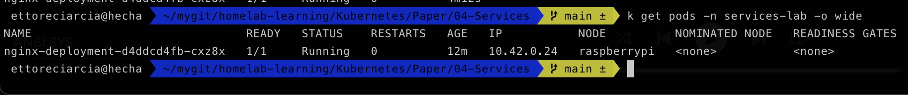

# Services


Credo che capire come funziona Kubernetes sia in gran parte capire come funziona il suo netwrking. Oggi daremo spazio ai Services, un oggetto Kubernetes fondamentale a livello di networking.

I pod hanno bisogno di un modo per trovare altri pod all'interno del cluster e no, un semplice indirizzo IP non basta.
Dobbiamo sempre tenere a mente che quando lavoriamo con i Pod stiamo lavorando con unità effimere, il nostro cluster può scalare il numero di pod verso l'alto o verso il basso, può rimuovere un pod da un nodo e farne il provisioning su un altro nodo.

Ai pod, come le scale di Hoghwarts, piace cambiare


I **Services** sono la risorsa Kubernetes ched ci permette di creare un singolo e costante punto di accesso ad un gruppo di pod (L'indirizzo IP di un services non cambia nel tempo)

Ma come fa un service a sapere su quali pod ruotare il traffico che lo raggiunge?
Utilizzando la label **selector** che attaccheremo ai pod.

Normalmente i Service inoltrano il traffico in maniera casuale ai pod 

## Quale problema risolvono i Services e perché dovremmo utilizzarli?

Nel laboratorio di oggi utilizzremo la famossima immagine di nginx ed ed esporremo il pod su cui quest'applicazione gira con diversi tipi di Services.

Cominciamo! 

(Nell'esperimento utilizzerò il mio homelab con K3s sul mio RaspberrPI, ma qualsiasi distro Kubernetes andrà bene. Se non ne hai ancora installata una, dai un'occhiata a Kind (Kubernetes in Docker) o a Minikube (Kubernetes in VM))

```kubectl create deployment nginx-deployment --image=nginx:latest -n testing-lab --dry-run=client -o yaml > deployment.yaml```

Con questo comando andiamo a creare il kubernetes manifest che applicheremo per la creazione del nostro pod nginx. Il vostro file ```deployment.yml``` dovrebbe contenere

```yaml
apiVersion: apps/v1
kind: Deployment
metadata:
  creationTimestamp: null
  labels:
    app: nginx-deployment
  name: nginx-deployment
  namespace: services-lab
spec:
  replicas: 1
  selector:
    matchLabels:
      app: nginx-deployment
  strategy: {}
  template:
    metadata:
      creationTimestamp: null
      labels:
        app: nginx-deployment
    spec:
      containers:
      - image: nginx:latest
        name: nginx
        resources: {}
status: {}
```

Ricordiamo di creare il namespace in cui andremo a creare le nostre risorse

```kubectl create ns servicees-lab```

A questo punto possiamo applicare il manifest precedentemente creato
```kubectl apply -f deplyment.yaml```

e verificare che il deployment sia stato preso in carico da Kubernetes

```k get deployments -n services-lab```


A questo punto avremo quindi
- 1 Deployment
- 1 ReplicaSet
- 1 Pod

Il nostro pod, al momento, non è esposto. Ma ha un indirizzo IP, vediamolo!



Quindi, cosa succederebbe se provassi a contattare questo pod da un altro pod all'interno di Kubernetes?

Creiamo un nuovo pod che utilizzeremo per testare la comunicazione interna al cluster.
Lo chiameremo "Grimaldello" e partirà da un''immagine con delle utility di networking molto comode

Lanciamo:
``` kubectl create ns utility```

```kubectl create deployment grimaldello --image=praqma/network-multitool:extra -n utility --dry-run=client -o yaml > utility.yaml```

Questa volta non indaghiamo troppo il contenuto del manifest, in un atto di fede lanciamo

```kubectl apply -f utility.yaml``` (Magari salvatelo, può tornarvi utili quando farete troubleshooting nei vostri cluster :) )

Perfetto, ora dovreste trovarvi in questa situazione


Grimaldello sarà "Il nostro uomo all'interno", proviamo a conttare il pod di nginx da Grimaldello.

Prendiamo una shell in grimaldello

```k get pods -n utility```

```k exec -it  [POD_NAME] -n utility -- sh``

E proviamo a contattare direttamente il pod di nginx utilizzando l'indirizzo IP di quest'ultimo:


Perfetto, il nostro pod di nginx ci ha risposto sulla porta 80 all'indirizzo IP del pod. Quindi perché dovremmo complicarci tanto la vita aggiungendo un ulteriore livello di astrazione?

Ve lo faccio vedere con una serie di comandi ;)

Con questo andiamo a scalare il numero di repliche del nostro deployment di nginx a 0

```k scale deploy nginx-deployment --replicas=0 -n services-lab```

E ora andiamo a riportare il numero di repliche a 1

```k scale deploy nginx-deployment --replicas=1 -n services-lab```

E ora? Che indirizzo IP avrà il nuovo pod appena creato?


L'indirizzo iè è cambiato da ```10.42.0.24``` a ```10.42.0.27```.
Questo però genera un problema: se un set di pod (chiamiamolo backend) fornisce delle funzionalità ad un set di pod (chiamiamolo forntend), come potrebbe il frontend tenere traccia dei cambiamenti di indirizzi IP a cui connettersi?

Abbiamo bisogno quindi di una risorsa che "astragga" i pod e ci dia un punto di accesso non mutabile ai pod presenti dietro di essa. Quella risorsa è rappresentata dai Services.

### Discovering Services through environment variables

Come al solito prendiamo la shell all'interno del nostro container e lanciamo un semplice
```env```

Cosa sono tutte queste variabili d'ambiente scritte con CAPS e undescore?
Qunado un pod è in esecuzione su un nodo, la kubelet aggiunge a quel pod un set di variabili d'ambiente In particolare, per ogni service che andremo a creare nel cluster, aggiungerà le variabili d'ambiente

```{SVCNAME}_SERVICE_HOST```
```{SVCNAME}_SERVICE_PORT```

Ogni volta che un nuovo service viene creato, due variabili d'ambiente saranno aggiunte dalla kubelet all'interno delle env di tutti i container che vengono avvviati


## Discovering services through DNS

Tra i pod presenti nel namespace **kube-system** ne abbiamo uno chiamato **kube-dns** a cui sarà associato un Service (anch'esso nel namespace kube-system).
Come suggerisce il nome, in questo pod è in esecuzione un server DNS che tutti gli altri pod in esecuzione all'interno del cluster utilizzeranno di default.

## Raggiungere i Service mediante FQDN

Nel nostro esempio il pod "Grimaldello" può connettersi al pod di nginx raggungendo il service di nginx e mediante il seguente FQDN;

nginx-svc.services-lab.svc.cluster.local

- **nginx-svc** è il nome del Service associato al pod
- **services-lab** è il namespace in cui questo Service si trova
- **svc.cluster.local**  è un suffisso di dominio del cluster configurabile utilizzato in tutti i nomi dei servizi locali del cluster.

#### ClusterIP

Ci permette di esporre il Service con un indirizzip IP interno al cluster. Utilizzando questo tipo di Services lo si renderà raggiungibile solo dall'interno del cluster. È anche il valore di default che kubernetes utilizza se non viene specificata la sezione ```type``` all'interno del manifest.

```yaml
apiVersion: v1
kind: Service
metadata:
  name: nginx-svc
  namespace: services-lab
spec:
  selector:
    app: nginx-deployment
  ports:
    - port: 80
      targetPort: 80
  type: ClusterIP
```

Andiamo quindi a creare il service:

```k create -f clusterIP.yaml```

Riavviato il pod di nginx, andiamo a vedere cosa è stato aggiunto all'interno delle sue variabili d'ambiente.
Sono state aggiunte le due env:

```NGINX_SVC_PORT_80_TCP=tcp://10.43.52.200:80```
```NGINX_SVC_PORT=tcp://10.43.52.200:80```

Proviamo ora a contattare il nostro service dal grimaldello :)

Prendiamo la solita shell e lanciamo il comando

```curl nginx-svc.services-lab```


A questo punto, se anche andassimo ad effettuare uno scale-down/scale-up del deployment di nginx non avremmo più problemi di connettività tra Grimaldello ed nginx, in quanto abbiamo il nostro services di tipo ClusterIP nel mezzo!

### NodePort

Espone il service su ogni nodo del cluster Kubernetes utilizzando una porta statica.

```yaml
apiVersion: v1
kind: Service
metadata:
  name: nginx-svc
  namespace: services-lab
spec:
  selector:
    app: nginx-deployment
  ports:
    - port: 80
      targetPort: 80
      nodePort: 31000 #Se se vi vuole fissare una porta, altrimenti il valore sarà casuale
  type: NodePort
```

La definiziione del manifest resta la stessa, eccetto per la sezione ```type``` che in questo caso è di tipo ```NodePort```.
La porta sarà assegnata in un range casuale (il default è 30000-32767) o in alternativa si può fissarla utilizzando l'attributo ```nodePort```.

Utilizzando questo service saremo quindi in grado di raggiungere il pod contattando direttamente i nodi del cluster. Suponnendo per esempio che l'indirizzo IP di uno dei nodi sia ```192.168.0.2```, e che la porta sia quella che troviamo descrivendo il service appena creato


potremmo contattare il nostro pod da un dispositivo nella subnet del cluster con il comando

 


### Load Balancer

Utilizzato soprattutto nel caso di Cluster Kubernetes "managed" dai vari Cloud Provider (EKS, AKS, GKE, OKE) permette di esporre i service kubernetes su Internet andando a creare un load balancer come risorsa nel cloud che si sta utilizzando. Questo loadbalancer avrà un indirizzo IP pubblico e sarà quindi raggiungibile dall'esterno.

In questo caso le annotations nella definizione del manifest possono cambiare a seconda del cloud provider. Nel caso di un service di tipo Load Balancer su AWS avremo un manifest di questo tipo:

```yaml
apiVersion: v1
kind: Service
metadata:
  name: nlb-sample-service
  namespace: nlb-sample-app
  annotations:
    service.beta.kubernetes.io/aws-load-balancer-type: external
    service.beta.kubernetes.io/aws-load-balancer-nlb-target-type: ip
    service.beta.kubernetes.io/aws-load-balancer-scheme: internet-facing
spec:
  ports:
    - port: 80
      targetPort: 80
      protocol: TCP
  type: LoadBalancer
  selector:
    app: nginx
```

### ExternalIP

Se sono presenti IP esterni che instradano a uno o più nodi del cluster, i Services Kubernetes possono essere esposti su quegli IP esterni. Il traffico che entra nel cluster con l'IP esterno (come IP di destinazione), sulla porta del servizio, verrà instradato a uno degli endpoint del servizio. ExternalIP non sono gestiti da Kubernetes e sono di responsabilità dell'amministratore del cluster.
Questo tipo di load balancer è utilizzato molto raramente
