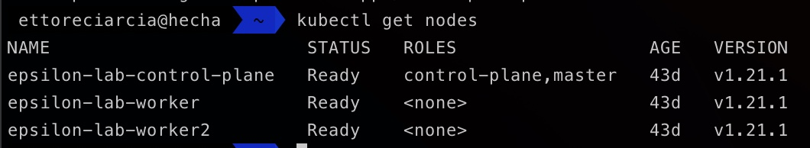
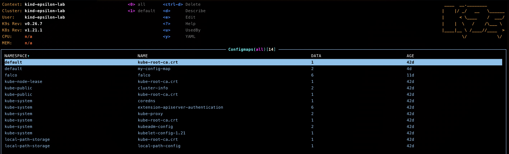
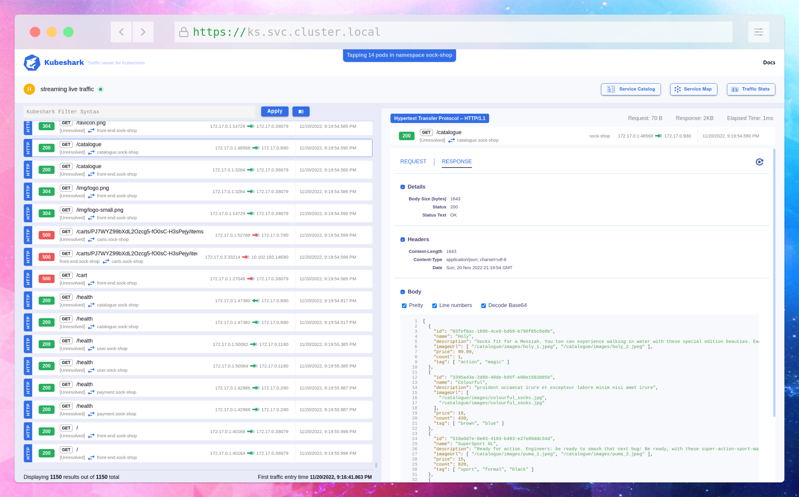

# Tool utili per indentatori di YAML

Utilizzare Kubernetes può essere doloroso, in questo articolo mostreremo alcuni tool e consigli che possono semplificare il lavoro giornaliero dei nostri amici indentatori di YAML!

### Interagire con il cluster
#### - Kubectl

Kubectl è uno strumento della riga di comando per interagire con un cluster Kubernetes. Con kubectl, puoi eseguire diverse operazioni di gestione dei cluster, come deploy di container, scale di risorse, visualizzazione dello stato dei cluster e altro ancora. kubectl è uno strumento indispensabile per chiunque lavori con Kubernetes.


#### -  Kubernetes Dashboard

Le Kubernetes Dashboard sono un'interfaccia web per Kubernetes che ti consente di interagire con il tuo cluster in modo grafico. Con le Dashboard puoi eseguire operazioni di gestione del cluster, come il deploy di container, la scale delle risorse e la visualizzazione dello stato del cluster. Le Dashboard sono uno strumento utile per facilitare la gestione del cluster, soprattutto se non sei un esperto di Kubernetes o se preferisci un'interfaccia grafica alle operazioni della riga di comando.


#### - K9s

K9s è una interfaccia a riga di comando per Kubernetes che ti permette di gestire il tuo cluster in modo facile e veloce. Con K9s, puoi visualizzare e gestire i tuoi pods, i servizi, le risorse di rete e altro ancora utilizzando solo il tuo terminale. K9s offre un'interfaccia intuitiva basata sulla riga di comando, con la quale puoi eseguire facilmente le operazioni di base come la creazione, il rollout e il debug delle tue applicazioni. Inoltre, include una serie di strumenti di monitoraggio e di debug per aiutarti a risolvere i problemi e a ottimizzare le prestazioni delle tue applicazioni. Se stai cercando uno strumento veloce e semplice per gestire il tuo cluster Kubernetes, K9s potrebbe essere una buona opzione da considerare.



#### - Lens

Lens è una interfaccia grafica open-source per Kubernetes. Ti permette di gestire il tuo cluster Kubernetes e le tue applicazioni in modo facile e intuitivo, utilizzando una singola dashboard. Con Lens, puoi visualizzare e gestire facilmente i tuoi container, pods, servizi, risorse di rete e altro ancora. Inoltre, offre una serie di strumenti di debug e di monitoraggio per aiutarti a risolvere i problemi e a ottimizzare le prestazioni delle tue applicazioni.


### Gestione dei contesti

Se lavorate con più cluster Kubernetes vi ritroverete a gestire più contesti. 
Ci sono due approcci:

#### - Un singolo file per contesto

Organizzate i vostri contesti in singoli file, che contengono solo quel contesto.
Quando averete bisogno di fare operazioni  in un determinato cluster potete lanciare il comando

```shell
export KUBECONFIG=~/.kube/kind
```
#### - Singolo file per contesti multipli e kubectx

L'alternativa al primo approccio è raccogliere tutti i contesti in un singolo file.
Se scegliete questa strada un tool come [kubectx](https://github.com/ahmetb/kubectx) può esservi di aiuto per cambiare rapidamente contesto.


### Alias

Per essere più veloci nell'utilizzo di kubectl potete farvi aiutare dagli alias.
Ecco una lista di alias che può farvi risparmiare un po' di tempo

```shell
alias k='kubectl'
alias kc='k config view --minify | grep name'
alias kdp='kubectl describe pod'
alias c='clear'
alias kd='kubectl describe pod'
alias ke='kubectl explain'
alias kf='kubectl create -f'
alias kg='kubectl get pods --show-labels'
alias kr='kubectl replace -f'
alias ks='kubectl get namespaces'
alias l='ls -lrt'
alias kga='k get pod --all-namespaces'
alias kgaa='kubectl get all --show-labels'
```

Per configurare permantemente gli alias all'interno del vostro sistema potete aggiungere la lista riportate sopra all'interno dei seguenti file (in base al sistema operativo su cui vi trovate)

- Bash ```~/.bashrc```
- ZSH  ```~/.zshrc```


### Troubleshooting
#### Kubeshark

Tool molto valido per l'analisi del traffico all'interno dei vostri container.
Permette di analizzare il traffico all'interno del vostro cluster con diversi livelli di granularità: potete scegliere se farlo a livello di namespace, di deployment (daemonset o statefullset), di services.
È un po' come utilizzare tcpdump all'interno di un container, ma con kubeshark potete farlo rapidamente e in maniera visuale.
Pensate a una sorta di TCPDump e Wireshark, ma ridisegnati per Kubernetes!
Riferimenti a [Kubeshshark](https://kubeshark.co/)



#### wbitt/Network-Multitool

Sì, lo so. È un nome strano per un tool, sembrerebbe trattarsi proprio di un'immagine Docker. Lo è!
È l'immagine che utilizzo per creare un pod nel cluster! E tipicamente chiamo quel pod "grimaldello", contiene un sacco di utility per fare troubleshooting a livello di rete/container.
