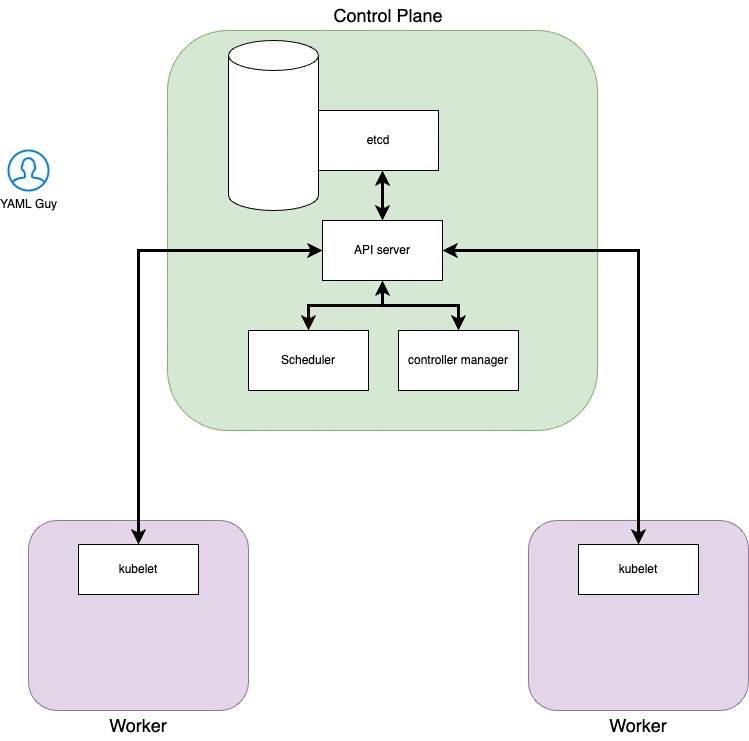

# Kubernetes overview 

Chiunque abbia seguito un tutorial su Kubernetes ha lanciato il comando
```kubectl create deployment epsilon-bootcamp --image=nginx --replicas=3```
E ha potuto ammirare soddisfatto il pod in esecuzione all'interno del cluster Kubernetes.

Con questo comando stiamo dicendo al cluster 
"Hey K8s, vorrei un **deployment** chiamato epsilon-bootcamp, al cui interno ci sia un pod con tre **repliche** e che i container all'interno del pod partano dall'**immagine** ufficiale di nginx."

A questo punto alcuni hanno cambiato la descrizione del profilo Linkedin in "Kubernetes Tech Lead Engineer", altri hanno cominciato ad approfondire questo tool.
Probabilmente, chi non si è fermato in superfice, sta ancora scavando.


Cosa c'è dietro Kubernetes? Quale "magia" ha fatto arrivare quel pod su quel nodo? E perché proprio quel nodo?

In questo articolo daremo una panoramica di quelli che sono gli attori coinvolti affinchè la "magia" funzioni.


Saranno coinvolti i seguenti componenti:

1. **Api Server** che ci permette di interagire con il cluster tramite chiamate API. È l'unico compontente che scrive su etcd e a cui gli altri si rivolgono quando hanno svolto il loro compito 

2. **Scheduler** schedulerà ed allocherà i nostri pod sulle macchine worker. Controlla i pod appena creati che non hanno un nodo assegnato e, dopo averlo identificato, glielo assegna. I fattori presi in considerazioni nell'individuare un nodo a cui assegnare l'esecuzione di un Pod includono la richiesta di risorse del Pod stesso e degli altri workload presenti nel sistema, i vincoli delle hardware/software/policy, le indicazioni di affinity e di anti-affinity, requisiti relativi alla disponibilità di dati/volumi, le interferenze tra diversi workload e le scadenze

3. **Controller** sono diversi applicativi che vanno a verificare lo stato del cluster interagendo con l'API server e controllano lo stato del cluster confrontandolo con quello desiderato dall'utente. Nel caso in cui questi due stati non combacino, lo scheduler sarà responsabile di far convergere lo stato del cluster verso quello desiderato dall'utente.
Esistono diversi tipi di scheduler, uno per ogni tipo di risorse che possiamo creare in kubernetes

4. **etcd** è un archivio dati di tipo chiave valore. Serve a mantenere lo stato del cluster.

5. **Kubelet** un agente che è eseguito su ogni nodo del cluster. Si assicura che i container siano eseguiti in un pod e comunica direttamente con l'api-server

7. **Kubectl** è il principale tool utilizzato per intaragire con il cluster Kubernetes. Lo fa autenticandosi sul control plane e facendo chiamate API di vario tipo.


Andremo a creare le seguenti risorse:

1. **Pods**  Il pod è l'unità atomica di Kubernetes. Possiamo vederlo come una raccolta di uno o più container Linux. Si tratta di un'unità effimera che può essere distrutta e ricreata in base allo stato che viene dichiarato.
2. **Replica Set** Ha lo scopo di mantenere un set stabile di pod in esecuzione in qualsiasi momento. Viene utilizzato per garantire la disponibilità di un numero specifico di Pod identici.
3. **Deployment**: oggetto che fornisce aggiornamenti dichiarativi alle applicazioni. Consente di descrivere il ciclo di vita di un'applicazione, ad esempio quali immagini utilizzare per l'app, il numero di pod presenti e il modo in cui devono essere aggiornati.


Proviamo ora a ripercorrere gli step che ci portano dall'esecuzione del nostro comando fino all'effettivo avvio del container all'interno del cluster


##### 1. Lanciamo il comando

```kubectl create deployment epsilon-bootcamp --image=nginx --replicas=3```

##### 2. Kubectl si autentica sul cluster

Hai presente il file in ```.kube/config```?
Ecco, quello è il file in cui si trova il **contesto (context)**.

In Kubernetes un contesto è l'insieme dei parametri di accesso che contiene le informazioni relative al cluster Kubernetes, utente e namespace. Possiamo vedere il context come la configurazione che utilizziamo per accedere ad un cluster.

##### 3. Kubectl effettua la chiamata API all'API Server
In questa fase il tool kubectl tradurrà il nostro comando in un'API di Kubernetes. Un concetto fondamentale da capire quando si lavora con Kubernetes è che tutto è un'API.
Anche quando applichiamo un manifest kubectl lo traduce in una chimata API e contatta l'api-server.

Per esempio, supponendo di voler avere una lista di tutti i namespace presenti all'interno del cluster, possiamo lanciare il comando
```kubectl get namespaces```

o interrogare direttamente l'api-server con la chiamata 

```http://[control-plane-ip]:[PORT]/api/v1/namespaces``` (in realtà questa API ritorna informazioni più dettagliate rispetto a quelle che avremmo lanciando il solo comando kubectl per avere la lista dei namespace)

Trovi informazioni più dettagliate sulle API messe a disposizione da Kubernetes a questo [link](https://kubernetes.io/docs/concepts/overview/kubernetes-api/)

##### 4. L'API server valida il manifest
Dopo esserci autenticati sull'api server quest'ultimo validerà il manifest che gli abbiamo mandato. Superarto il check di conformità si va avanti, altrimenti il client riceverà un messaggio di errore

##### 5 L'API server aggiorna lo stato di Etcd
Validato il manifest lo stato desiderato dall'utente viene scritto in etcd e questo mette in moto una serie di componenti all'interno del cluster
TO DO AGGIUNGERE SCREEN ETCD STATO CLUSTER 
Scriviamo "Deployment" in etcd

A questo punto la connessione tra il nostro client e l'api-server termina, abbiamo fatto tutto quello che c'era da fare. Da qui in poi sarà Kubernetes a fare il resto del lavoro

##### 6. Il Controll Manager entra in gioco
Il control manager ha una serie di loop (uno per ogni risorsa che è possibile creare nel cluster) e quello adibito al controllo dei deployments nota che lo stato desiderato dall'utente che ha appena aggiunto un deployment non combacia con lo stato attuale del cluster.
In questo caso specifico il control manager dei deployments andrà a creare un risorsa di tipo **Replica Set**.
Per farlo comunicherà con l'API server e quest'ultimo aggiornerà lo stato di etcd aggiungendo quanto chiesto dal controll manager.
Lo stato di ectd è stato nuovamente aggiornato e il controller dei Replica Set si accorge che lo stato di ectd non combacia con quello attuale del cluster. Comunciherà quindi all'API server di aggiungere i pod richiesti dal replica set e l'api-server aggiornerà nuovamente lo stato di etcd con i 3 pods.

Avete mai visto la scritta "Pending" nello stato quando lanciate un kubectl get pods? Ecco, quando un pod risulta pending è perché lo stato di ectd è stato aggiornato quindi il cluster sa di dover creare quel pod.

Il pod, in quanto unità atomica di Kubernetes, non rientra in alcun loop

##### 7. Scheduler
A questo punto lo scheduler nota che ci sono dei pod con status pending e, in base alle caratteristiche che hanno, li assegnerà a determinati nodi.
Nel nostro caso sappiamo per certo che quei nodi non potranno essere schedulati sul control plane.
Quello che lo scheduelr farà sarà cercare di tenere il carico dei nodi bilanciato

##### 8. Kubelet
Kubelet, agente installato su ogni nodo, sa di dover creare i pod richiesti dallo scheduler. Comunicherà quindi all'api server che i pod stanno per essere creati.
In realtà il Kubelet fa molto più di questo, specialmente per quanto riguarda il networking. Ma questo lo vedremo nel prossimo articolo :)


Spero che questa rappresentazione grafica possa aiutarti a rendere più chiaro il flusso descritto sopra:




Bonus memino a tema:


