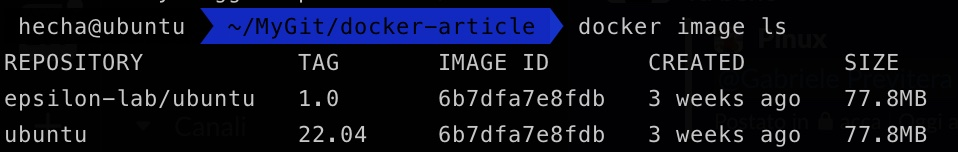
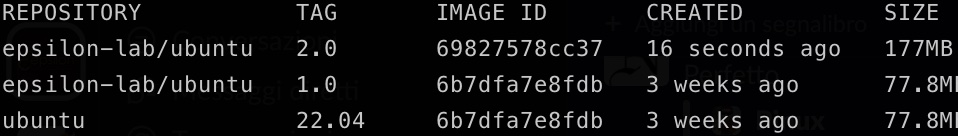
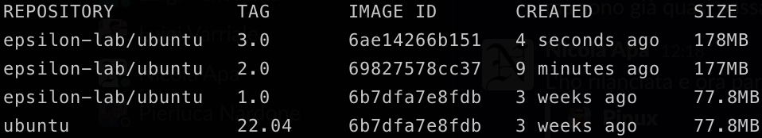
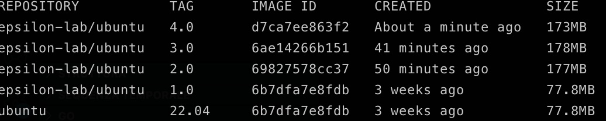

# Smaller docker images

In questo articolo andremo a creare delle immagini Docker via via sempre più piccole di un'applicazione di prova.
L'applicazione che stiamo containerizzando è scritta in Go e si limita a rispondere a richieste HTTP ad un certo path.

Ecco il codice della nostra semplice applicazione

```Go
package main
import (
	"fmt"
	"net/http"
)

func main() {
	http.HandleFunc("/", HelloServer)
	http.ListenAndServe(":8080", nil)
}

func HelloServer(w http.ResponseWriter, r *http.Request) {
	fmt.Fprintf(w, "Hello, %s!", r.URL.Path[1:])
}
```

Ma prima di buttarci a capofitto nella build della del nostro container, proviamo a dare qualche definizione che ci tornerà utile più avanti!

#### Cos'è un Dockerfile?

Un Dockerfile è un file di testo che contiene le istruzioni per la costruzione di un'immagine Docker. Ogni riga del Dockerfile rappresenta un'istruzione che Docker eseguirà quando lanciamo il comando ```docker build```. L'immagine risultante di questa operazione potra essere usata per avviare un container.
Le istruzioni contenute nel Dockerfile vengono eseguite in sequenza.
Ogni istruzione è composta da un comando e da zero o più argomemnti.
Qualunque sia l'immagine che stiamo creando, il nostro Dockerfile conterrà almeno questa istruzione:

```Dockerfile
FROM [BASE_IMAGE]
```

Dove **BASE_IMAGE** rappresenta l'immagine su cui la nostra nuova immagine si baserà.
Per esempio, se vogliamo che la nostra immagine venga creata a partire dall'ultima versione di Ubuntu possiamo utilizzare l'istruzione

```Dockerfile
FROM ubuntu:22:04
```

#### La nostra prima immagine Docker

Proviamo a buildare questa immagine e vedere cosa succede!

Creiamo un file chiamato *Dockerfile* che contiene la nostra unica istruzione ```FROM ubuntu:22:04``` e proviamo a creare la nostra prima immagine con il comando

```shell
docker build -t epsilon-lab/ubuntu:1.0 . 
```

Ora possiamo vedere l'immagine appena creata utilizzando il comando
```bash
docker image ls
```

Dovremmo vedere le seguenti immagini:



Ma perché ne abbiamo due? Il nostro Dockerfile dovrebbe crearne una sola!
La risposta sta nel fatto che la nostra immagine è basata su ubuntu:22.04 ma è di fatto una nuova immagine. Per buildare la nuova immagine il nostro demone Docker ha effettuato la pull dalla registry ufficiale Docker dell'immagine di ubuntu:22.04 e a partire da quella ha creato la nostra nuova immagine *epsilon-lab/ubuntu:1.0*

Proviamo a giocare con il nostro container!
Avviamolo lanciando il comando 

```docker run -dit epsilon-lab/ubuntu:1.0```

Dopo aver verificato che il nostro container è in esecuzione, proviamo ad ottenere una shell con il comando

```docker exec -it [CONTAINER_ID] /bin/bash```

Una volta nel container, in maniera del tutto arbitraria, decidiamo di creare una file utilizando l'editor più odiato del mondo IT: vim

Con il comando

```bash
vim yamlguy.txt
```

e ci accorgiamo con nostro grande dispiacere che l'editor non è presente all'interno del container.
A questo punto potremmo essere tentati di installare direttamente vim all'interno del nostro container ubuntu, ma questa è una **pessima** pratica.
I container non hanno persistenza (se non montiamo volumi), quindi una volta riavviato il container tornerebbe in esecuzione ma Vim sarebbe di nuovo assente.

Il nostro container è stato creato a partire da un Dockerfile, se vogliamo che tutti i container reati a partire dalla nostra immagine abbiano al proprio interno Vim come editor di testo dobbiamo lavorare sul Dockerfile.

Aggiungiamo quindi la seguente riga al Dockerfile di partenza

```Dockerfile
RUN apt-get update
RUN apt-get install -y vim
```

E andiamo a creare una nuova immagine del nostro container:

```bash
docker build -t epsilon-lab/ubuntu:2.0 . 
```

Verifichiamo che l'immagine sia stata effettivamente creata



Wow! È grande è più del doppio rispetto all'immagine originale! 
Siamo felicissimi, finalmente possiamo utilizzare Vim all'interno del nostro container!

Ma poi pensiamo che Vim nel container non vogliamo averlo. E abbiamo imparato che lavorare all'interno di un container creato a partire da un'immagine non è una buona pratica!
Decidiamo quindi di disinstallare Vim, ma lasciamo gli step precendenti all'interno del Dockerfile ottenendo:

```Dockerfile
FROM ubuntu:22.04
RUN apt-get update -y
RUN apt-get install -y vim
RUN apt-get purge -y vim
```

Abbiamo quindi la nostra immagine con tag 3.0 ma notiamo che c'è qualcosa di strano


Com'è possibile che l'immagine con tag 3.0 abbiamo un peso maggiore dell'immagine con tag 2.0? Il nostro container 3.0 non ha Vim e ha un peso addirittura maggiore della stessa immagine ma con Vim installato

La risposta sta nei **Layer** Docker!

#### Cos'è un Layer Docker?

In Docker, ogni istruzione in un Dockerfile crea un layer nell'immagine. Ogni layer rappresenta uno stato dell'immagine, e i layer vengono utilizzati per creare una "storia" dell'immagine. Ad esempio, se un Dockerfile contiene le istruzioni per installare un software, il layer creato da questa istruzione conterrà il software installato. Se successivamente si modifica il file di configurazione del software, un nuovo layer conterrà la nuova configurazione del software. Allo stesso modo, se in un passo successivo si disinstalla quel software, non si sta alleggerendo l'immagine Docker finale ma la si sta appesentando con un ulteriore Layer!

I livelli Docker memorizzano la differenza tra la versione precedente e quella corrente dell'immagine. E come i commit git sono utili se li condividi con altri repository o immagini.

Infatti, quando richiedi un'immagine da un registro, scarichi solo i livelli che non possiedi già. In questo modo è molto più efficiente condividere le immagini.

**Ma i livelli hanno un costo!**

I livelli usano lo spazio e più livelli hai, più pesante è l'immagine finale. I repository Git sono simili sotto questo aspetto. La dimensione del tuo repository aumenta con il numero di livelli perché Git deve memorizzare tutte le modifiche tra i commit.


I layer sono anche utili per la gestione delle immagini. Ad esempio, è possibile utilizzare il comando **docker history** per visualizzare la storia dei layer di un'immagine e vedere quali operazioni sono state eseguite durante la creazione dell'immagine. Inoltre, è possibile utilizzare i layer per creare nuove immagini a partire da un'immagine esistente, modificando solo alcuni dei layer dell'immagine originale.

Ecco svelato il segreto che si nascondeva dietro immagini che ci saremmo aspetatti più leggere rispetto ad altre e che si sono rivelate poi più pesanti.

### Prima riduazione dell'imagine

Abbiamo imprato che ogni istruzione all'interno del Dockerfile ha un costo e attualmente nel nostro Dockerfile abbiamo 4 istruzioni. Cosa succede se riduciamo il numero di istruzioni in cui utilizziamo il comando **RUN** accorpandole in un'unica riga?

Otteniamo il seguente Dockerfile

```Dockerfile
FROM ubuntu:22.04
RUN apt-get update -y  && apt-get install -y vim && apt-get purge -y vim
```

I comandi sono identici a quelli dell'immagine con tag 3.0 ma per quanto detto prima ci aspettiamo che l'immagine con tag 4.0 abbiamo una dimensione inferiore perché abbiamo accoporto 3 layer in 1!

