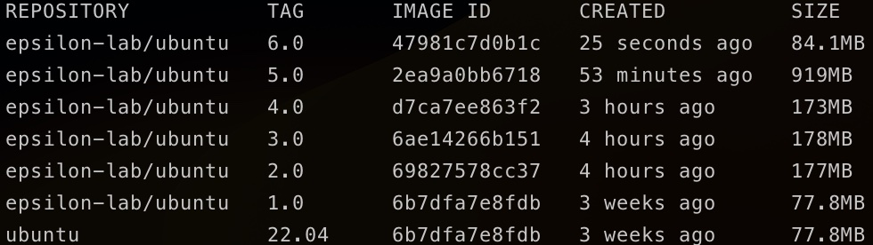

# Smaller docker images

In queesto articolo vedremo come ridurre la dimensione delle nostre immagini Docker.

Ma perché dovremmo farlo? Dopotutto un'immagine vale l'altra, basta che funzioni!
In realtà non è così, ci sono una serie di validi motivi per ridurre la dimensione delle immagini Docker:

- Le immagini Docker più piccole sono più facili da distribuire e scaricare, questo può essere utile se si utilizza una registry di immagini o si condivide l'immagine con altre persone
- Le immagini Docker più piccole richiedono meno spazio su disco, il che può essere utilie se si ha uno spazio di archiviazione limitato
- Le immagini Docker più piccole si avviano più rapidamente, il che può essere utile se quelle imamgini vengono utilizzate in un ambiente di produzione dove è importante ridurre al minimo i tempi di avvio
- Le immagini Docker più piccole consumano meno risorse durante l'esecuzione, il che può essere utile se si utilizzano molti container sullo stesso host
- Immagini più piccole sono più sicure in quanto all'aumentare dei pacchetti e delle dipendenze presenti in un'immagine aumenta il numero di vulnerabilità a cui quel container potrebbe essere esposto.

Quindi, i vantaggi immediati dal ridurre la dimensione delle immagini che abbiamo in produzione sono i seguenti:

- **Riduzione dei costi**: meno spazio di archiviazione necessario e minor conosumo di risorse
- **Performance**: i container saranno più veloci in fase di avvio
- **Sicurezza**: meno codice contiene un'immagine e meno sarà vulnerabile

Ma prima di buttarci a capofitto nella riduzione di un'immagine partiamo dai fondamentali.

#### Cos'è un Dockerfile?

Un Dockerfile è un file di testo che contiene le istruzioni per la costruzione di un'immagine Docker. Ogni riga del Dockerfile rappresenta un'istruzione che Docker eseguirà quando lanciamo il comando ```docker build```. L'immagine risultante di questa operazione potra essere usata per avviare un container.
Le istruzioni contenute nel Dockerfile vengono eseguite in sequenza.
Ogni istruzione è composta da un comando e da zero o più argomemnti.
Qualunque sia l'immagine che stiamo creando, il nostro Dockerfile conterrà almeno questa istruzione:

```Dockerfile
FROM [BASE_IMAGE]
```

Dove **BASE_IMAGE** rappresenta l'immagine su cui la nostra nuova immagine si baserà.
Per esempio, se vogliamo che la nostra immagine venga creata a partire dall'ultima versione di Ubuntu possiamo utilizzare l'istruzione

```Dockerfile
FROM ubuntu:22:04
```

#### La nostra prima immagine Docker

Proviamo a buildare questa immagine e vedere cosa succede!

Creiamo un file chiamato *Dockerfile* che contiene la nostra unica istruzione ```FROM ubuntu:22.04``` e proviamo a creare la nostra prima immagine con il comando

```shell
docker build -t epsilon-lab/ubuntu:1.0 . 
```

Ora possiamo vedere l'immagine appena creata utilizzando il comando

```bash
docker image ls
```

Dovremmo vedere le seguenti immagini:


Ma perché ne abbiamo due? Il nostro Dockerfile dovrebbe crearne una sola!
La risposta sta nel fatto che la nostra immagine è basata su ubuntu:22.04 ma è di fatto una nuova immagine. Per buildare la nuova immagine il nostro demone Docker ha effettuato la pull dalla registry ufficiale Docker dell'immagine di ubuntu:22.04 e a partire da quella ha creato la nostra nuova immagine *epsilon-lab/ubuntu:1.0*

Proviamo a giocare con il nostro container!
Avviamolo lanciando il comando

```docker run -dit epsilon-lab/ubuntu:1.0```

Dopo aver verificato che il nostro container è in esecuzione, proviamo ad ottenere una shell con il comando

```docker exec -it [CONTAINER_ID] /bin/bash```

Una volta nel container, in maniera del tutto arbitraria, decidiamo di creare una file utilizando l'editor più odiato del mondo IT: vim

Con il comando

```bash
vim yamlguy.txt
```

e ci accorgiamo con nostro grande dispiacere che l'editor non è presente all'interno del container.
A questo punto potremmo essere tentati di installare direttamente vim all'interno del nostro container ubuntu, ma questa è una **pessima** pratica.
I container non hanno persistenza (se non montiamo volumi), quindi una volta riavviato il container tornerebbe in esecuzione ma Vim sarebbe di nuovo assente.

Il nostro container è stato creato a partire da un Dockerfile, se vogliamo che tutti i container creati a partire dalla nostra immagine abbiano al proprio interno Vim come editor di testo dobbiamo lavorare sul Dockerfile.

Aggiungiamo quindi la seguente riga al Dockerfile di partenza

```Dockerfile
RUN apt-get update
RUN apt-get install -y vim
```

E andiamo a creare una nuova immagine del nostro container:

```bash
docker build -t epsilon-lab/ubuntu:2.0 . 
```

Verifichiamo che l'immagine sia stata effettivamente creata


Wow! È grande è più del doppio rispetto all'immagine originale!
Siamo felicissimi, finalmente possiamo utilizzare Vim all'interno del nostro container!

Ma poi pensiamo che Vim nel container non vogliamo averlo. E abbiamo imparato che lavorare all'interno di un container creato a partire da un'immagine non è una buona pratica!
Decidiamo quindi di disinstallare Vim, ma lasciamo gli step precendenti all'interno del Dockerfile ottenendo:

```Dockerfile
FROM ubuntu:22.04
RUN apt-get update -y
RUN apt-get install -y vim
RUN apt-get purge -y vim
```

Abbiamo quindi la nostra immagine con tag 3.0 ma notiamo che c'è qualcosa di strano


Com'è possibile che l'immagine con tag 3.0 abbia un peso maggiore dell'immagine con tag 2.0? Il nostro container 3.0 non ha Vim e ha un peso addirittura maggiore della stessa immagine ma con Vim installato

La risposta sta nei **Layer** Docker!

#### Cos'è un Layer Docker?

In Docker, ogni istruzione in un Dockerfile crea un layer nell'immagine. Ogni layer rappresenta uno stato dell'immagine, e i layer vengono utilizzati per creare una "storia" dell'immagine. Ad esempio, se un Dockerfile contiene le istruzioni per installare un software, il layer creato da questa istruzione conterrà il software installato. Se successivamente si modifica il file di configurazione del software, un nuovo layer conterrà la nuova configurazione del software. Allo stesso modo, se in un passo successivo si disinstalla quel software, non si sta alleggerendo l'immagine Docker finale ma la si sta appesentando con un ulteriore Layer!

I livelli Docker memorizzano la differenza tra la versione precedente e quella corrente dell'immagine. E come i commit git sono utili se li condividi con altri repository o immagini.

Infatti, quando richiedi un'immagine da un registro, scarichi solo i livelli che non possiedi già. In questo modo è molto più efficiente condividere le immagini.

**Ma i livelli hanno un costo!**

I livelli usano lo spazio e più livelli hai, più pesante è l'immagine finale. I repository Git sono simili sotto questo aspetto. La dimensione del tuo repository aumenta con il numero di livelli perché Git deve memorizzare tutte le modifiche tra i commit.

I layer sono anche utili per la gestione delle immagini. Ad esempio, è possibile utilizzare il comando **docker history** per visualizzare la storia dei layer di un'immagine e vedere quali operazioni sono state eseguite durante la creazione dell'immagine. Inoltre, è possibile utilizzare i layer per creare nuove immagini a partire da un'immagine esistente, modificando solo alcuni dei layer dell'immagine originale.

Ecco svelato il segreto che si nascondeva dietro immagini che ci saremmo aspetatti più leggere rispetto ad altre e che si sono rivelate poi più pesanti.

Quest'immagine può aiutarti a capire cosa sta succedendo


___

Dopo questa breve introduzione vediamo come è possibile ridurre la dimensione delle nostre immagini Docker 
#### 1 Accorpare i Layer

Abbiamo imprato che ogni istruzione all'interno del Dockerfile ha un costo e attualmente nel nostro Dockerfile abbiamo 4 istruzioni. Cosa succede se riduciamo il numero di istruzioni in cui utilizziamo il comando **RUN** accorpandole in un'unica riga?

Otteniamo il seguente Dockerfile

```Dockerfile
FROM ubuntu:22.04
RUN apt-get update -y  && apt-get install -y vim && apt-get purge -y vim
```

I comandi sono identici a quelli dell'immagine con tag 3.0 ma per quanto detto prima ci aspettiamo che l'immagine con tag 4.0 abbiamo una dimensione inferiore perché abbiamo accoporto 3 layer in 1!


Abbiamo risparimiato 5MB sulla nostra immagine semplicemente accorpando le istruzioni!


Ora proviamo ad eseguire la nostra applicazione all'interno del container!

L'applicazione che stiamo containerizzando è scritta in Go e si limita a rispondere a richieste HTTP ad un certo path.

Ecco il codice della nostra semplice applicazione

```Go
package main
import (
 "fmt"
 "net/http"
)

func main() {
 http.HandleFunc("/", HelloServer)
 http.ListenAndServe(":8080", nil)
}

func HelloServer(w http.ResponseWriter, r *http.Request) {
 fmt.Fprintf(w, "Hello, %s!", r.URL.Path[1:])
}
```

E questo sarà il Makefile della nostra applicazione:

```Makefile
build:
 go build -o main main.go

run:
 go run main.go
```

Doobiamo creare un Dockerfile che preveda la copia della nostra applicazione all'interno del container e l'esecuzione del nostro eseguibile risultante dalla build del codice.

Supponendo che il codice sorgente si trovi alla stessa profondità del nostro Dockerfile, possiamo procedere in questo modo

```Dockerfile
FROM ubuntu:22.04
RUN apt-get update -y  && apt-get install -y vim && apt-get purge -y vim && apt install -y golang-go && apt-get install -y make
WORKDIR /app
COPY . .
RUN make build
ENTRYPOINT ["./main"]

```

una volta creata l'immagine possiamo confrontarne la dimensione con quelle create in precedenza


Con i layer aggiunti siamo passati da un'immagine di 173MB a una di 919MB.
Vogliamo davvero portare in produzione un container così pesante?
Certo che no! Ridurremo presto la dimensione di questa immagine :)

A questo punto il nostro container è pronto a ricevere connessioni HTTP, testiamo subito il codice!

```shell
docker run -dit -p 8080:8080 epsilon-lab/ubuntu:5.0
```

Possiamo quindi effettuare una GET su localhost

```shell
curl localhost:8080/HelloWorld
```

Riceveremo come risposta *HelloWorld*

Cerchiamo di ridurne la dimensione

#### 2. Multi-Stage Builds

Proviamo a fare il punto della situazione:
il nostro Dockerfile esegue una serie di istruzioni, al termine delle quali crea l'eseguibile di cui abbiamo bisogno e lo esegue.

Ma quello di cui noi abbiamo bisogno è soltanto l'eseguibile, non ci servono tutte le librerie installate per creare l'eseguibile

Il nostro Dockerfile, può quindi diventare qualcosa di questo tipo

```Dockerfile
FROM ubuntu:22.04 as build-step
RUN apt-get update -y  && apt-get install -y vim && apt-get purge -y vim && apt install -y golang-go && apt-get install -y make
WORKDIR /app
COPY . .
RUN make build

FROM ubuntu:22.04
WORKDIR /app
COPY --from=build-step /app/main .
ENTRYPOINT ["./main"]

```

E andiamo a confrontare come al solito l'immagine appena creata con le precedenti



Il risultato è giù soprendente! Il multi-stage ci ha fatto risparmiare un sacco di spazio

#### 3. Utlizzare base image leggere e minimali

Nel nostro esempio abbiamo creato il container partendo dall'immagine di *ubuntu:22.04*.
Ma abbiamo davvero bisongo di tutte quelle librerie e dipendenze per creare un semplice eseguibile?
E se potessimo creare il nostro eseguibile a partire da un'immagine super leggera?

Proviamo a fare qualche modifica al nostro Dockerfile utilizzando come immagine di base **Alpine** e rimuovendo gli esperimenti fatti nella sezione in cui mostravamo il funzionamento dei layer

Otterremmo un'immagine di questo tipo:

```Dockerfile
FROM golang:1.19.1-alpine as build-step
RUN apk add make
WORKDIR /app
COPY . .
RUN make build

FROM alpine:3.17.0
WORKDIR /app
COPY --from=build-step /app/main .
ENTRYPOINT ["./main"]
```

Proviamo ora ad effettuare la build del nostro container

```shell
docker build -t epsilon-lab/ubuntu:7.0 .
```

E diamo un'occhiata alle dimensioni dell'immagine appena creata


Utilizzando *alpine* abbiamo ridotto la dimensione della nostra immmagine da 84.1MB a 13.6MB :)

#### 4. Distroless

In questo  step utilizzeremo un'immagine Docker *golang:1.19.1* che contiene già al suo interno *make* e utilizzeremo un'immagine distroless per eseguire il nostro server web

```Dockerfile
FROM golang:1.19.1 as build-step
WORKDIR /app
COPY . .
RUN make build

FROM gcr.io/distroless/static:nonroot
WORKDIR /app
COPY --from=build-step /app/main .
USER nonroot:nonroot

ENTRYPOINT ["./main"]
```

E buildiamo come al solito la nostra immagine

```docker build -t epsilon-lab/ubuntu:8.0 .```


*gcr.io/distroless/static:nonroot* è il nome di un'immagine Docker basata su Distroless, un progetto di Google che fornisce immagini Docker senza distribuzione di base (come Alpine o Debian). L'immagine "gcr.io/distroless/static:nonroot" è specificamente progettata per eseguire programmi statico-compilati senza l'accesso a una shell o a altre utility di sistema.

Le immagini distroless sono intese per l'utilizzo in ambienti di produzione dove è importante minimizzare la superficie d'attacco e ridurre al minimo le dipendenze. Poiché l'immagine non include una shell o altre utility di sistema, è più difficile per gli attaccanti eseguire comandi dannosi o sfruttare vulnerabilità di sicurezza. Tuttavia, l'assenza di queste utility può rendere più difficile il debugging o la risoluzione dei problemi in caso di errori.

### 5 .dockerignore

Possiamo aggiungere al nostro progetto un file **.dockerignore** per specificare i ile o le directory che non devono essere inclusi nell'immagine Docker durante la build.
Quando si utilizza il comando "docker build" per creare un'immagine, Docker invia tutti i file presenti nella directory di build al daemon Docker per essere inclusi nell'immagine. Il file ".dockerignore" consente di escludere alcuni file o directory dall'invio al daemon, il che può rendere il processo di build più veloce e ridurre le dimensioni dell'immagine finale.

Per esempio, un file *.dockerignore* di questo tipo

```
*.o
node_modules/
```

ignorerà tutti i file con estensione *.o* e e la directory *node_modules*

### 6. Build cache

La build cache è una funzionalità di Docker che consente di utilizzare i risultati di una build precedente per velocizzare il processo di build di un'immagine. Quando si utilizza la build cache, Docker controlla se esiste già un layer dell'immagine con gli stessi comandi di build e le stesse dipendenze. Se esiste, Docker utilizza il layer esistente invece di ricompilare il layer da zero, il che può velocizzare significativamente il processo di build.

Per utilizzare al meglio la build cache è consigliabile organizzare i comandi di build in modo tale che quelli che cambiano meno spesso siano posizionati più in alto nel file "Dockerfile". Ciò aumenterà la possibilità che i primi layer dell'immagine siano presenti nella build cache e non debbano essere ricompilati.

___

### Tool utili nella costruzione di immagini Docker

Ora che abbiamo imparato come costruire immagine Docker leggere e minimali, possiamo farci aiutare da qualche tool :)

#### Hadolint

Hadolint è un linter per Docker basato sulla riga di comando che analizza il file "Dockerfile" e segnala eventuali problemi di formattazione o best practice non rispettate.

Questa è la repo a cui è possibile scaricarlo -> [hadolint](https://github.com/hadolint/hadolint)

Provate ad utilizzarlo sui primi Dockerfile scritti in questo articolo e poi sull'ultimo :)