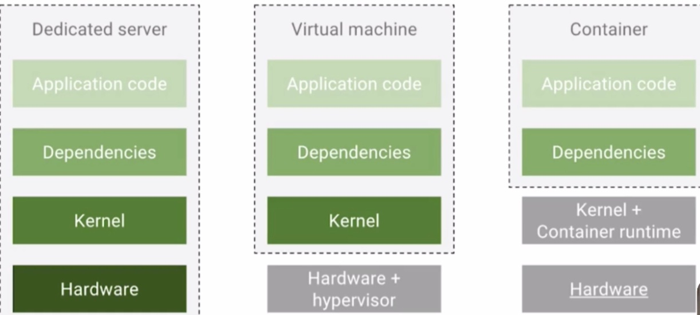

# Kubernetes

## 1. Introduzione 

Kubernetes è una piattaforma portatile, estensibile e open-source per la gestione di carichi di lavoro e servizi containerizzati, in grado di facilitare sia la configurazione dichiarativa che l'automazione. La piattaforma vanta un enorme ecosistema in rapida crescita.
Il nome di Kubernetes deriva dal greco, signiffica timoniere o pilota ed è nato da un progetto che Google ha reso open source nel 2014

### Come siamo arrivati a Kubernetes?

**Deployment tradizionale** All'inizio, le organizzioni eseguivano applicazioni su server fisici. Non avendo modo di limitare le risorse per le applicazoioni questo approccio ha casuato non pochi problemi.
Una possibile soluzione era quella di far girare una sola applicazione per server fisico, ma non è ideale.

**Deployment virtualizzato** Come soluzione venne introdotta la virtualizzazione. Essa consente di eseguire più macchine virtuali (VM) su una singola CPU fisica. La virtualizzazione consente di isolare le applicazioni su più macchine virtuali e fornisce un livello di sicurezza superiore, dal momento che le informazioni di un'applicazione non sono liberamente accessibili da un'altra applicazione.
Inoltre la virtualizzazione consente un migliroe utilizzo delle risorrse riducendo i costi per l'hardware e permette una maggiore scalabitlià.

**Deployment containerizzato** I container sono simili a macchine virtuali ma presentano un modello di isolamento più leggero, condividendo il sistema operartivo (OS) tra le applicazioni. Analogamente ad una macchina virtuale un container dispone di una segregazione di File System, CPU, memoria PID e altro ancora.. Poichè sono disaccoppiati dall'infrastruttura sottostante, risultano portabili tra differenti cloud e distribuzioni.

I container sono viventati popolari dal momento che offrono molteplici vantaggi:

- Creazione e distrubizione di applicazioni in modalità Agile: maggiore velocità ed efficienza nella creazioni di immmagini di container rispetto a quelle di macchine virtuali
- Adozione di pratiche per lo sviluppo/test/Rilascio continuativo: consente la frequente crezione e la distribuzione di container image affidabili
- Separazione delle fasi di Dev e Ops: le immagini vengono al momento della compilazione dell'applicativo piuttosto che nel momento del rilascio, permettendo così di disaccoppiare le applicazioni dall'infrastruttura sottostante.
- Coerenza di ambiente tra sviluppo, test e produzione: i container funzionano allo stesso modo su un computer portatile come nel cloud
- Microservizi liberamente combinabili, distribuiti e ad alta scalabilità: le applicazioni sono suddivise in pezzi più piccoli e indipendenti che possono essere distribuite e gestite dinamicamente. Niente stack monolitici che girano su un'unica grande macchina
- Isolamento delle risorse: le prestazioni delle applicazioni sono prevedibili
- Utilizzo delle risorse: le prestazioni delle applicazioni sono prevedibili

#### Tradizionale vs Virtualizzato vs Containerizzato

### Definizione di container

Un contenitore docker (container) non è altro che l'insieme dei dati di cui necessita un'applicazione per essere eseguita: librerie, altri eseguibili, rami del file system, file di configurazione, script, ecc.

Possiamo vedere un container come un processo isolato.

Per distribuire un'applicazione basterà quindi creare una semplice **immagine docker**. Quest'immagine sarà utilizzata successivamente da docker per creare un container.

Un container è un'entità autosufficiente e leggera e soprattuto **portabile** in quanto distribuito in un formato standard che può essere letto ed eseguito da qualsiasi server docker.

I container sono un'alternativa alla classica virtualizzazione ma offrono una maggiore flessibilità nella gestione delle risorse e una maggiore sicurezza
Sono il classico esempio di virtualizzazione leggera e si basano sulle caratteristiche proprie del Kernel Linux, in particolare **cgroups** e **namespaces**

- *control groups*: sono lo strumento utilizzato dal kernel Linux per gestire l’utilizzo delle risorse di calcolo da parte di un gruppo specifico di processi. Grazie ai cgroups è possibile limitare la quantità di risorse utilizzate da uno o più processi. Ad esempio, è possibile limitare il quantitativo massimo di memoria RAM che un gruppo di processi può utilizzare.

- *namespaces* : sono essenzialmente dei “contenitori” che astraggono le risorse offerte dal kernel. Quando un processo fa parte di un certo namespace esso potrà accedere soltanto alle risorse presenti nel namespace.

L'incremento prestazionale dovuto all'utilizzo dei container si deve all'eliminazione di uno strato: a differenza di una macchina virtuale, i processi eseguiti da un container sono di fatto eseguiti dal sistema ospitante(Linux), usufruendo dei servizi eseguiti dal sistema che quest'ultimo esegue. Non andremo quindi a sovraccaricare il sistema caricando un altro kernel per intero per ogni VM. Possiamo vederlo come una sorta di kernel condiviso.

In un ambiente basato su container, dove quindi non è presente un Hypervisor, queste funzionalità sono assolte dal kernel del sistema operativo ospitante. Linux dispone di due caratteristiche progettate proprio per questo scopo: **Control Groups (o cgroups)** e **Namespaces**.

Osservazione: Tuttavia, ricordiamo che non è possibile eseguire container Linux direttamente sul kernel Windows (dato che, per l’appunto, non si virtualizza il sistema operativo ospite). In questi casi (host Windows ed immagini Linux), Docker ricorre comunque ad una macchina virtuale Linux, in esecuzione su HyperV.

#### Container vs VM
Dovresti già avere una certa familiarità con le VM: un sistema operativo guest come Linux o Windows in esecuzione su un sistema operativo host e con accesso all'hardware sottostante. I container vengono spesso paragonati alle macchine virtuali (VM). Come le macchine virtuali, i container consentono di pacchettizzare le applicazioni insieme a librerie e altre dipendenze, garantendo ambienti isolati per l'esecuzione dei servizi software. 

I container sono molto più leggeri delle macchine virtuali
I container eseguono la virtualizzazione a livello del sistema operativo, mentre le macchine virtuali a livello di hardware
I container condividono il kernel del sistema operativo e utilizzano una frazione della memoria richiesta dalle VM

___

## 2. Installazione

Per gli esercizi in questa guida ho utilizzato K3s installato su un RaspberryPi 4, ma ci sono altre alternative.

**Minikube**: Kubernetes in macchina virtuale
**Kind**: Kubernetes in Docker container
**MicroK8s**
**EKS/GKE/AKS**: cluster K8s gestiti da Cloud Provider

___

## 3. Architettura di un Cluster Kubernetes