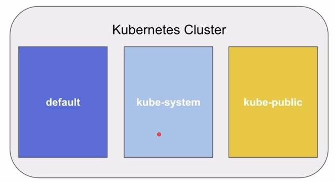
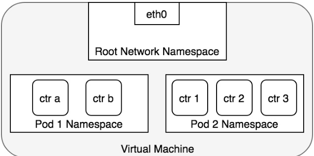

# Kubernetes

## 1. Introduzione 

Kubernetes è una piattaforma portatile, estensibile e open-source per la gestione di carichi di lavoro e servizi containerizzati, in grado di facilitare sia la configurazione dichiarativa che l'automazione. La piattaforma vanta un enorme ecosistema in rapida crescita.
Il nome di Kubernetes deriva dal greco, signiffica timoniere o pilota ed è nato da un progetto che Google ha reso open source nel 2014

### Come siamo arrivati a Kubernetes?

**Deployment tradizionale** All'inizio, le organizzioni eseguivano applicazioni su server fisici. Non avendo modo di limitare le risorse per le applicazoioni questo approccio ha casuato non pochi problemi.
Una possibile soluzione era quella di far girare una sola applicazione per server fisico, ma non è ideale.

**Deployment virtualizzato** Come soluzione venne introdotta la virtualizzazione. Essa consente di eseguire più macchine virtuali (VM) su una singola CPU fisica. La virtualizzazione consente di isolare le applicazioni su più macchine virtuali e fornisce un livello di sicurezza superiore, dal momento che le informazioni di un'applicazione non sono liberamente accessibili da un'altra applicazione.
Inoltre la virtualizzazione consente un migliroe utilizzo delle risorrse riducendo i costi per l'hardware e permette una maggiore scalabitlià.

**Deployment containerizzato** I container sono simili a macchine virtuali ma presentano un modello di isolamento più leggero, condividendo il sistema operartivo (OS) tra le applicazioni. Analogamente ad una macchina virtuale un container dispone di una segregazione di File System, CPU, memoria PID e altro ancora.. Poichè sono disaccoppiati dall'infrastruttura sottostante, risultano portabili tra differenti cloud e distribuzioni.

I container sono viventati popolari dal momento che offrono molteplici vantaggi:

- Creazione e distrubizione di applicazioni in modalità Agile: maggiore velocità ed efficienza nella creazioni di immmagini di container rispetto a quelle di macchine virtuali
- Adozione di pratiche per lo sviluppo/test/Rilascio continuativo: consente la frequente crezione e la distribuzione di container image affidabili
- Separazione delle fasi di Dev e Ops: le immagini vengono al momento della compilazione dell'applicativo piuttosto che nel momento del rilascio, permettendo così di disaccoppiare le applicazioni dall'infrastruttura sottostante.
- Coerenza di ambiente tra sviluppo, test e produzione: i container funzionano allo stesso modo su un computer portatile come nel cloud
- Microservizi liberamente combinabili, distribuiti e ad alta scalabilità: le applicazioni sono suddivise in pezzi più piccoli e indipendenti che possono essere distribuite e gestite dinamicamente. Niente stack monolitici che girano su un'unica grande macchina
- Isolamento delle risorse: le prestazioni delle applicazioni sono prevedibili
- Utilizzo delle risorse: le prestazioni delle applicazioni sono prevedibili

#### Tradizionale vs Virtualizzato vs Containerizzato


### Definizione di container

Un contenitore docker (container) non è altro che l'insieme dei dati di cui necessita un'applicazione per essere eseguita: librerie, altri eseguibili, rami del file system, file di configurazione, script, ecc.

Possiamo vedere un container come un processo isolato.

Per distribuire un'applicazione basterà quindi creare una semplice **immagine docker**. Quest'immagine sarà utilizzata successivamente da docker per creare un container.

Un container è un'entità autosufficiente e leggera e soprattuto **portabile** in quanto distribuito in un formato standard che può essere letto ed eseguito da qualsiasi server docker.

I container sono un'alternativa alla classica virtualizzazione ma offrono una maggiore flessibilità nella gestione delle risorse e una maggiore sicurezza
Sono il classico esempio di virtualizzazione leggera e si basano sulle caratteristiche proprie del Kernel Linux, in particolare **cgroups** e **namespaces**

- *control groups*: sono lo strumento utilizzato dal kernel Linux per gestire l’utilizzo delle risorse di calcolo da parte di un gruppo specifico di processi. Grazie ai cgroups è possibile limitare la quantità di risorse utilizzate da uno o più processi. Ad esempio, è possibile limitare il quantitativo massimo di memoria RAM che un gruppo di processi può utilizzare.

- *namespaces* : sono essenzialmente dei “contenitori” che astraggono le risorse offerte dal kernel. Quando un processo fa parte di un certo namespace esso potrà accedere soltanto alle risorse presenti nel namespace.

L'incremento prestazionale dovuto all'utilizzo dei container si deve all'eliminazione di uno strato: a differenza di una macchina virtuale, i processi eseguiti da un container sono di fatto eseguiti dal sistema ospitante(Linux), usufruendo dei servizi eseguiti dal sistema che quest'ultimo esegue. Non andremo quindi a sovraccaricare il sistema caricando un altro kernel per intero per ogni VM. Possiamo vederlo come una sorta di kernel condiviso.

In un ambiente basato su container, dove quindi non è presente un Hypervisor, queste funzionalità sono assolte dal kernel del sistema operativo ospitante. Linux dispone di due caratteristiche progettate proprio per questo scopo: **Control Groups (o cgroups)** e **Namespaces**.

Osservazione: Tuttavia, ricordiamo che non è possibile eseguire container Linux direttamente sul kernel Windows (dato che, per l’appunto, non si virtualizza il sistema operativo ospite). In questi casi (host Windows ed immagini Linux), Docker ricorre comunque ad una macchina virtuale Linux, in esecuzione su HyperV.

#### Container vs VM
Dovresti già avere una certa familiarità con le VM: un sistema operativo guest come Linux o Windows in esecuzione su un sistema operativo host e con accesso all'hardware sottostante. I container vengono spesso paragonati alle macchine virtuali (VM). Come le macchine virtuali, i container consentono di pacchettizzare le applicazioni insieme a librerie e altre dipendenze, garantendo ambienti isolati per l'esecuzione dei servizi software. 

I container sono molto più leggeri delle macchine virtuali
I container eseguono la virtualizzazione a livello del sistema operativo, mentre le macchine virtuali a livello di hardware
I container condividono il kernel del sistema operativo e utilizzano una frazione della memoria richiesta dalle VM

___

## 2. Installazione

Per gli esercizi in questa guida ho utilizzato **K3s** installato su un RaspberryPi 4, ma ci sono altre alternative.

**Minikube**: Kubernetes in macchina virtuale
**Kind**: Kubernetes in Docker container
**MicroK8s**
**EKS/GKE/AKS**: cluster K8s gestiti da Cloud Provider

___

## 3. Architettura di un Cluster Kubernetes


Un cluster è un insieme di macchine fisiche o virtuali sulle quali sono installati i componenti che costituiscono un cluster Kubernetes. 
Questo cluster può essere inteso come il sistema operativo del Cloud in quanto il ruolo fondamentale di un SO è quello di allocare le risorse hardware e fornire un'astrazione all'utente senza che questo si debba preoccupare di come viene effettuato lo scheduling dei processi all'interno del SO. Kubernetes fa una cosa analoga, astrae i dettagli implementativi delle macchine.

Gli **utenti** (Developer o amministratori) possono interagire con il nostro cluster attraverso le API (maniera diretta) o atrraverso la CLI (kubectl). Una maniera alternativa è quella di una UI.

I **Nodi Master** (generalmente più di uno) sono il cervello del nostro cluster. Sono i nodi che vanno a coordinare le operazioni del cluster.
Un nodo master è sua volta composto da: 

- **Api Server** che ci permette di interagire con il cluster tramite chiamate API. Possiamo vederlo come il front end del control plane di Kubernetes. È progettato per scalare orizzontalmente, cioè scala aumentando il numero di instanze. Possiamo eseguire multiple istanze di kube-apiserver e bilanciare il traffico tra queste istanze

- **Scheduler** schedulerà ed allocherà i nostri pod sulle macchine worker. Controlla i pod appena creati che non hanno un nodo assegnato e, dopo averlo identificato, glielo assegna.
I fattori presi in considerazioni nell'individuare un nodo a cui assegnare l'esecuzione di un Pod includono la richiesta di risorse del Pod stesso e degli altri workload presenti nel sistema, i vincoli delle hardware/software/policy, le indicazioni di affinity e di anti-affinity, requisiti relativi alla disponibilità di dati/Volumes, le interferenze tra diversi workload e le scadenze

- **Controller** sono diversi applicativi che vanno a verificare lo stato del cluster interagendo con l'API server e controllano lo stato del cluster confrontandolo con quello desiderato dall'utente. Nel caso in cui questi due stati non combacino, lo scheduler sarà responsabile di far convergere lo stato del cluster verso quello desiderato dall'utente

- **etcd** è un archivio dati di tipo chiave valore di tipo distribbuito e ridondato. Server a mantenere lo stato del cluster. È in giallo perché non sempre viene deployato all'interno del cluster K8S ma potrebbe essere gestito come un servizio esterno. 

I **nodi worker** sono i "muscoli" del cluster e sono i nodi su cui andranno a girare i nostri container schedulati dallo scheduler. Sono composti da: Uno dei componenti fondamentali che caratterizza i worker è **kubelet**: un applicativo che permette ai nostri nodi worker di comunicare con il control plane.

- **kubelet**: un agente che è eseguito su ogni nodo del cluster. Si assicura che i container siano eseguiti in un pod. La kubelet riceve un set di PodSpecs che vengono forniti attraverso vari meccanismi, e si assicura che i container descritti in questi PodSpecs 
- **kube-proxy** è un proxy eseguito su ogni nodo del cluster, responsabile della gestione dei kubernetes service. I kube proxy mantengono le regole di networking sui nodi, queste regole permettono la comunicazione verso altri nodi del cluster o l'esterno.
- **container runtime**: è il software responsabile per l'esecuzione dei container. Kubernetes supporta diversi container runtime (containerd, cri-o,rklet). Docker è satto deprecato a partire dalla versione 1.20 di Kubernetes


### 3.1 Comunicazione nodo-worker -> control-plane

Kubernetes adotta una oattern per le API di tipo "hub and spoke": tutte le chiamate delle API eseguite sui vari nodi sono effettuate verso l'api server (nessuno degli altri componenti principali è progettato per esporre servizi remoti). L'api-server è progettato per l'ascolto di connessioni remote su una porta HTTPS (443) con una o più forme di autenticazioni client abilitate.

Il _certificato pubblico (public root certificateì)_ relativo al cluster corrente deve essere fornito ai vari nodi in modo che questi possano connettersi in modo sicuro all'API server insieme alle credenziali valide per uno specifico client.

I Pod che desiderano connettersi all'api server possono farlo in modo sicuro sfruttando un account di servizio in modo che Kubernetes inserisca automaticamente il certificato pubblico di radice (root) e un token valido al portatore (bearer token) all'interno del pod quando questo viene instaziato. In tutti i namespace è cofigurato un service con nome **kubernetes** con un indirizzo IP virtuale che viene reindirizzato (tramite kube-proxy) all'endpoint HTTPS dell'api server.

Anche i componenti del control-plane comunicano con l'api serverdel cluster su una porta sicura esposta da quest'ultimo

### 3.2 Comunicazione control-plane -> nodo-worker

Esistono due modi di comunicazione principale dal control-plane ai nodi.
1. Dall'api server al processo kubelet in esecuzione sui nodi worker
2. Dall'api server a ciascun nodo,pod o servizio attraverso la funzionalità **kube proxy**

Le connessioni dall'api-server verso un nodo, Pod o servizio avvengono in modalità predefinita su semplice connnessione HTTP e quindi non sono nè autenticate nè criptate. Non è attualemente sicuro eseguire queste connessioni su reti non protette o pubbliche
___

## 4 Risorse di Kubernetes

### 4.1 Pod

Un pod è un gruppo di container che funzionano in simbiosi. Il pod è l'unità fondamentale di Kubernetes.
Sono unità effimere che possono essere distrutte e ricreate in base allo stato che viene dichiatato. I pod hanno un indirizzo IP. Possiamo fare in modo che certi pod vengano schedulati solo su alcuni nodi attraverso le *label*
I container all'interno di uno stesso Pod comunicano su localhost


Nella foto possiamo vedere un node con l'indirizzo IP 10.0.0.1 al cui interno gira un pod con indirizzo IP 10.0.0.2 al cui interno girano 3 container che condividono due volumi

**Comandi utili**:

```k run nginx --image nginx:latest --dry-run=client -oyaml > pod-example.yaml``` -> Crea il manifest Pod con queste specifiche ma non lo lancia

```k exec -it nginx -- sh``` -> Per ottenere una shell nel pod

```k exec -it mc1 -c 2nd -- sh``` Qualora ci fossero due container nello stesso pod, potremmo scegliere in quale dei fue ottenere la shell utilizzando il flag -c

**Fonti**

- [Multi container pods and container communication](https://www.mirantis.com/blog/multi-container-pods-and-container-communication-in-kubernetes/)

- [Container vs Pods](https://iximiuz.com/en/posts/containers-vs-pods/)

- [Official documentation](https://kubernetes.io/docs/concepts/workloads/pods/)

### 4.2 Namespace

I namespace sono delle risorse che possono essere rappresentate all'interno del cluster. Il namespace serve per effettuare il partizionamento logico del nostro cluster Kubernetes.
Un pod deve essere necessariamente associato ad un namespace ma non può essere associato a più namespace.
I namespace vengono usati per gestire ambienti distinti



I namespace forniscono uno scope per i nomi delle risorse. Un pod avrà un nome ma questo nome DEVE essere unico all'interno di un namespace.
Possiamo però avere più namespace che contengono un pod con lo stesso nome. Al momento non è possibile definire namespace annidati.
Avere un cluster partizionato con i namespace non va ad isolare i workload, per farlo bisgona introdurre delle policy o plugin terzi. Diversamente due pod in namespace differenti possono comunicar 

(Esercizi)[https://docs.google.com/document/d/1NGgDXAyzBkop05k9IdlYsAxsVIMYoErNtlsvNpuEklw/edit]

### 4.3 Labels and Selectors

**Labels** Sono dei metadati associabili ad oggetti Kubernetes come ad esempio i Pod. Possono essere specificate nella definizione YAML del nostro oggetto.
Vengono utilizzate per poter raggruppare delle risorse che appartengono ad un'entitù più grandi e saranno molti importanti nel load balancing per effettuare un bilanciamento tra le varie repliche di un certo applicativo


In questo esempio stiamo raggruppando i pod per **type**


 
### 4.4 Replica set

È un oggetto il cui scopo è quello di garantire che un certo numero di pod di un applicativo sia up and running. Questo ci consente di avere l'alta affidabilità nel caso qualche replica possa venire a mancare

### 4.5 Deployments


Sono un oggetto che ha due scopi principali:
- Garantire che ci siano un certo numero di repliche di un certo numero di pod up and running
- Permette diverse strategie di rollout. Nel caso in cui andiamo a fare una release (fixianmo bug o nuove rilasciamo nuove feature). In questo caso possiamo effettuare rilascio gradualmente

```k create  deployment nginx --image nginx:latest --dry-run=client -oyaml > deploy.yaml```

*Come effettuiamo il rollout di un deployments?*
Esistono due tipologie di rollout:
- **RollingUpdate**: un rilascio graduale dell'applciativo senza downtime. Lentamente vengono creati nuovi pod con la nuova versione. Quando un pod della nuova versione è up and running (Controllo fatto tramite heatlh check), un pod della vecchia versione viene spento


- **Recreate**: questa strategia spegne i pdo esistenti e riaccende i pod della nuova versione. Questo comporta un breve periodo di downtime ma è un tipo di rilascio più rapido rispetto al rolling update

### 4.6 Services

Sono degli oggetti rappresentabili tramite API REST che funzionano come dei Network Load Balancer Virtuali davanti ai nostri Pod. Parliamo quindi di un bilancimaneto di rete che lavora al livello 4 della pila ISO/OSI e ragiona su indirizzi IP e porte. Abbiamo bisogno dei Services perché i nostri pod sono delle entità effimere (possono essere spostati, possono andare giù e non hanno degli indirizzi che sono stabili) e quindi necessitiamo dei services che hanno indirizzi stabili e nomi di dominio che vengono risolti da un server DNS interno


Il service distribuisce in maniera casuale il traffico ai pod che si trovano sotto di lui.
Come facciamo a sapere quali pod si trovano sotto un service? Anche in questo caso utilizziamo labels e selectors

I services possono essere di quattro tipi:
- **CLuster IP** È un bilanciatore di rete che viene esposto internamente al cluster
- **Node Port** Mappa una porta associata ad ogni nodo del cluster verso un service. Il tipo di service NodePort sono quelli più semplici da utilizzare e da implementare. In pratica, richiedono alle API di Kubernetes di assegnargli una porta (nell’esempio una porta TCP) casuale e che venga esposta all’esterno del cluster. La richiesta di un client può essere indirizza verso quella porta e la richiesta verrà indirizzata automaticamente verso il nodo corretto. Facendo un parallelo con il mondo telefonico, è come se facendo una chiamata verso un particolare numero esista la certezza di essere messi in contatto con la persona corretta. Il meccanismo di mappatura viene configurato automaticamente da Kubernetes, e questo lo rende semplice da utilizzare. L’unica particolarità è che Kubernetes mette a disposizione porte “random” solo nel range tra 30000  e 32767, sicuramente porte custom e che normalmente non generano conflitto con altri servizi, ma che sono sicuramente distanti dalle porte 80 e 443 dei servizi web che vogliamo esporre. Inoltre, la casualità della porta rilasciata rende le operazioni di configurazione di servizi come firewal, NAT non sempre facili.
- **Load Balancer** Ha senso nell'ambiente del public cloud. Nel momento in cui viene creato un service di tipo Load Balancer, il clooud provider andrà a fonire un bilanciatore del traffico (come risorsa del cloud). L’alternativa ai NodePort è il type LoadBalancer. Questo particolare type è leggermente piu’ complesso rispetto al NodePort e ha bisogno di alcuni prerequisiti, come ad esempio la presenza del cluster all’interno di un ambiente cloud e soprattutto è necessario sottostare alle configurazioni che vengono messe a disposizione da ogni singolo fornitore cloud (es. Google, Aws e Azure). Inoltre, un load balancer viene attivato per ogni service con questo particolare tipo associato, il che si traduce nell’utilizzo di un indirizzo IP che molto spesso viene fornito come servizio a pagamento.
L’assegnazione di una porta casuale (NodePort) oppure utilizzando il type LoadBalancer è necessario impostare una serie di configurazioni e soprattutto comporta una serie di problemi al crescere dei servizi da esporre. Inoltre, l’esposizione dei servizi tramite LoadBalancer comporta problemi di costi legati aggiuntivi al rilascio di ogni nuovo indirizzo ip .
In questo scenario, Kubernetes aveva la necessità di introdurre un meccanismo piu’ snello per l’esposizione dei servizi verso l’esterno. In questo scenario la piattaforma di Kubernetes ha introdotto un nuovo tipo di manifest che prende il nome di Ingress, con il compito di definire le regole che permettono di defnire l’accesso dal client al relativo servizio.
Ma cosa sono gli ingress? Sono dei pod, come qualsiasi altra applicazione, quindi sono posizionati all’interno del cluster e possono vedere altri pods. Sono sviluppati utilizzando proxy, sviluppati ormai da anni e che li rende particolarmente adattati e configurabili. In rete sono disponibili diverse tipologie di Ingress che possono essere scaricati ed installati, utilizzando package manager per Kubernetes, come ad esempio Helm. Un ingress che può essere installato è  NGINX Ingress Controller. Ogni ingress ha particolari caratteristiche che lo differenziano dagli altri, ma soprattutto che possono offrire performance differenti verso i servizi stessi.
Inoltre, essendo posizionati all’interno del cluster ed essendo di fatto dei veri e propri pods, sono soggetti alle stesse restrizioni. Anche in questo caso sarà necessario utlizzare NodePort e/o LoadBalancer, ma a differenza dell’esempio precedente ci troviamo ora ad aver implementato un unico punto di ingresso configurabile ed accessibile dall’esterno. L’utilizzo di un ingressa basato sul protocollo HTTP consente di ispezionare il contenuto della richiesta ed indirizzarla verso il servizio più appropriato, tramite l’analisi dell’URL, il nome del dominio ed header
- **External Name** non specifica dei nomi di Labels ma permette di mappare un nome DNS esterno con un nome DNS interno al cluster

### 4.7 Config Maps

Una risorsa di Kubernetes che permete la definizione di configurazioni di tipo key/value. Sono importanti perché ci permettono di staccare l'applicativo dalla sua definizione. I dati delle Config Maps possono essere esposte come env variables, montati come volumi oppure usate in un comando di un container. Non sono adatte per informazioni confidenziali (A questo scopo si utilizzano i Secret)

[Esercizi ConfigMap](https://docs.google.com/document/d/1U0gcgeessN766B02fIddPywZAALgPqGOakBhr2X_Yhs/edit)
### 4.7 Secrets

Sono oggetti di Kubernetes che vengono utilizzati per speficiare delle coppie key/value ma per memorizzare chiavi sensibili. I Secret possono essere esposti ai pod come env variables o montati come file. Possono essere di diversi tipi:
- **Opaque** Rappresenta un secret di tipo generico
- **SSH**
- **Certificati x509 TLS**
- **Configurazione del container run time**

È necessario che chi gestisce i lcluster si occupi dell'encryption at rest e delle **RBAC** per gestire l'accesso alle informazioni segrete 

### 4.8 Risorse all'interno dei Pod

Ad ogni pod sono associati due valori:

- **Requests** Il valore minimo delle risorse di cui quel pod ha bisogno per girare correttamente. In base a questo valore lo scheduler vedrà quali dei nodi può soddisfare le richieste minime di quel pod e se ne trova disponibili lo schedulerà su quel nodo
- **Limitis** Il limite massimo di risorse che un singolo pod può consumare. Impostare i limiti server a fare in modo che un singolo pod non monopolizzi la CPU o la memoria. Quando questi limiti vengono raggiunti il pod può essere "killato" (Limite di memoria) o riavviato (limite di CPU)

Questi valori sono associati ai singoli container che compongono un pod. Se un pod ha 3 container questi valori si sommano

### 4.9 Persistenza

Quando un container viene avviato nuovamente tutti i dati in esso contenuti vengono rimossi, salvo il caso in cui questi dati fosssero salvati su un volume esterno. Kubernetes mette a disposizione due tipi di risorse:

- **Persistent Volume**: fornito in maniera statica o come Storage Class in maniera dinamica. Il loro ciclo di vita è indipendente da quello dei pod. Specifica anche i dettagli dello storage sottostante

- **Persistent Volume Claim**: sono una richiesta di utilizzo di Storage da parte di un utente. Questo storage servirà ai nostri Pod. I PVC consumano storage, a differenza dei Pod che consumano CPU e memoria

*Come funziona il binding di un PVC ad un PV?*
1. Viene creato il pvc 
2. Il cluster fornisce o cerca un PV
3. PV e PVC vengono associati con un mapping one to one e bidirezionale

*Come viene utilizzato lo storage da parte dei pod?*
Il pod va a specificare un pvc come volume. A questo punto il cluster andrà a cercare il pvc, attraverso il quale troverò il PV associato a quel PVC. A questo punto sarà possibile montare quel filesystem sotto il pod che ha richiesto il pvc

*Cosa succede quando cancelliamo un PVC?*

Per il PV esiste la cosiddetta **Reclaim Policy**. Ne esistono 3:
- **Retain** Il PV viene lasciato in vita
- **Delete** Quando viene cancellato il PVC viene rimosso dal cluster anche il PV
- **Recycle** Permette di riciclare il nostro PV dopo averlo ripulito correttamente, quindi può essere utilizzato da un altro Pod

Questi oggetti permottono di astrarre i dettagli del provisioning dello storage.

[Esercizi sullo storage](https://docs.google.com/document/d/1ujRCRDPzJubONhPEbMqi6563tWYhEv0iPYTGir4_2yM/edit)
___
## 5 Osservabilità

### 5.1 Health Check
Sono dei controlli periodici che il cluster fa sui pod per verificarne lo stato. Questo controllo viene eseguito dall'agente kubeklet su ogni nodo.
Abbiamo 3 tipi di health chechk:
- **Liveness Probe**: viene utilizzato dal cluster per verificare se il container è partito correttamento. Se questo controllo fallisce il container viene marcato come *failed* e ne viene verificata la policy di *restart*
- **Readiness Probe** Permette di verificare se il nostro applicativo è pronto a servire il traffico. Se è pronto potrà quidni essere inserito nel pool di un service
- **Start up probe** Viene utilizzata nel caso di applicativi molto lenti a partire (Poco utilizzata perché è un anti pattern)

*In che modalità possono essere effettuate queste probe?*

Esistono 3 modi in cui questi controlli possono essere fatti:

- **Chiamata HTTP**
- **Apertura di una socket TCP**
- **Eseguendo un comando nel container**


Nell'osservabilità su Kubernetes i tool "terzi" come Prometheus e Grafana giocano un ruolo fondamentale in quanto i log dei singoli container gestiti da Kubenretes vengono cancellati in maniera ciclica. Utilizare tool esterni permette inoltre di avere informazioni più dettagliate su quello che sta succedendo nei singoli nodi o il dettaglio di ciò che è successo all'interno di un container

[Esercizi Osservabilità](https://docs.google.com/document/d/1uTPk19TUl2B6Oh5PwYZ8NHK9qhWV8dg3cpTn8CGIW8w/edit)
[Bonus errori comuni dei principianti con Kubernetes](https://docs.google.com/document/d/1flXRf9YpluSkuF5m2D7Ay1KTQBvaJ-AWawgb3fihar8/edit)

### 5.2 Prometheus
```k port-forward prometheus-deployment-77484b466d-4xbw6 8080:9090 -n monitoring```
___

## 6 Networking

Il networking è uno dei topic fondamentali in Kubernetes. Capire come funzionano i singoli componenti e come comuinicano tra loro permette di fare troubleshooting quando il cluster ha un comportamento che non abbiamo previsto.

Kubernetes segue le seguenti regole di default:

- Tutti i pods possonpo comunicare tra di loro senza utillizzare NAT
- Tutti i nodi possono comunciare con tutti i pods senza NAT
- L'IP che un pod vede associato a sè stesso è lo stesso IP con cui gli altri pod lo vedono

Date queste regole di default, ci sono 4 problemi relativi al networking da risolvere:

1. Container-to-Container Networking
2. Pod-to-Pod Networking
3. Pod-to-Service-Networking
4. Internet-to-Service Networking

### 6.1 Container-to-Container networking

In Linux ogni processo comunica con un *network namespace stack* che fornisce uno stack di rete logico con le sue rotte, i suoi network device e le sue regole firewall. in sostanza un network namespace stack fornisce uno stack di rete nuovo di zecca per tutti i prcoessi all'interno di quel namesapce.

Possiamo listare i network namesapce con ```ls /var/run/netns```

Di default, Linux assegna ogni processo al *root network namespace* che fornisce l'accesso al mondo esterno 


**Root Network Namespace**

In termini di costrutti Docker, un pod rappresenta un gruppo di container Docker che condividono lo stesso network namesapce. I container all'interno di un pod hanno tutti lo stesso indirizzo IP e lo stesso "spazio porta" assegnati tramite lo stesso network namespace e possono raggiungersi tramite localhost poichè risiedono nello stesso network namespace. Possiamo creare un nuovo network namespace per ogni pod su una macchina virtuale



Le applicazioni all'interno dello stesso pod hanno anche accesso a volumi condivisi che sono definiti come parte del pod nel manifest e sono disponibili per essere montati nel filesystem di ogni applicazione

### 6.2 Pod-to-Pod Netowking

In Kubernetes, ogni Pod ha il indirizzop IP reale e ogni Pod comunica con gli altri utilizzando questo indirizzo IP. Ma come fa Kubernetes a permettere a due pod presenti su nodi diversi di comunicare utilizzando i loro indirizzi IP?
Cominciamo con il caso in cui due Pod risiedono sullo stesso nodo.

Dal punto di vista del pod, esiste nel proprio Ethernet Namespace e ha il bisogno di comunicare con altri Ethernet Namespace sullo stesso nodo. Fortunatamente, i namespace possono essere collegati utilizzando un **Linux Virtual Ethrnet Device (Veth Pair)** che consinste in due interfacce virtuali che possono essere distribuite su namespace multipli. Per connettere i network namespace di due pod, possiamo assegnare un lato del veth pair alla root network namespace e l'altro ato ai network namespace dei pod. Ogni coppia di Veth funziona come se i due pod fossero fisicamente collegati da un cavo che consente al traffico di fluire tra i due Pod. Questa configurazione può essere replicata per tutti i pod che abbiamo sulla macchina


Questa [guida](https://linuxhint.com/use-linux-network-namespace/) mostra come creare, configurare e collegare un network namesapce al nostro attuale network namespace tramite veth 
La figura mostra le coppie di Veth che connettono ogni pod su una macchina virtuale al root network namespace


**Life of a packet: Pod-to-pod (same Node)**

Abbiamo quindi dei network namespaces che isolano ogni Pod al proprio networking stack, veth che connette ogni namesapace al root namespace e un bridge che connette insieme i namespace di ogni pod. Siamo finalmente pronti a mandare il traffico dal pod 1 al pod 2


Il Pod1 manda un pacchetto al proprio Ethernet Device **eth0** che è disponibile come default device per il pod. PEr il Pod1, **eth0** è connesso tramite **veth0** al **root namespace**. Il Bridge **cbr0** è configurato con **veth0** come segmento di rete a esso collegato. una volta che il pacchetto ha raggiunto il bridge, il bridge risolve il corretto segmento di rete a cui mandare il pacchetto (**veth1**) tramite ARP protocol. Quando il pacchetto raggiunge **veth1** è inoltrato al network namespace del Pod2.
Con questo flusso i pod comunicano soltanto con localhost e eth0 e il traffico è ruotato al pod corretto.

Il modello di Netowrking di Kubernetes impone che due Pod devono potersi raggiungere grazie ai loro IP anche quando si trovano su nodi differenti. L'IP di un pod è quindi sempre visibile agli altri pod nella rete e ogni pod vede il proprio indirizzo IP esattamente come lo vedono gli altri Pod.

**Life of a packet: Pod-to-pod (across Nodes)**

Generalmente, ad ogni nodo del cluster viene assegnato un blocco CIDR che specifica gli indirizzi IP disponibili per i Pod in esecuzione su quel nodo. Una volta che il traffico destinato al blocco CIDR raggiunge il nodo, è responsabilità del nodo inoltrare il traffico al Pod corretto


Il flusso comincia esattamente come nel caso in cui la comunicazione avvenisse tra due Pod dello stesso nodo.
Il pacchetto viene inoltrato all' **eth0** del pod1 che è "accoppiata" con **veth0** nel root namespace.
Qui le cose cambiano, in quanto ARP fallirà nella risoluzione del segmento di rete a cui inviare il pacchetto quindi il pacchetto si ferma al bridge, non avendo disponibili indirizzi MAC corretti a cui inoltrarlo,
Al fallimento, il bridge manderò il pacchetto alla **default route (quella del root namespace eth0**). A questo punto il pacchetto lascia il nodo ed entra nella rete.
Assumiamo per il momento che la rete possa ruotare il pacchetto al nodo corretto basandosi sul CIDR block assegnato al nodo. 
A questo punto il pacchetto entra nel root namespace del **secondo nodo** tramite **eth0**. Finalmente pla rotta viene completata attraverso il corretto **veth** che risiede nel namespace corretto. Una volta raggiunto il nodo, generalmente è il nodo stesso che provvede ad ioltrarlo al pod correto