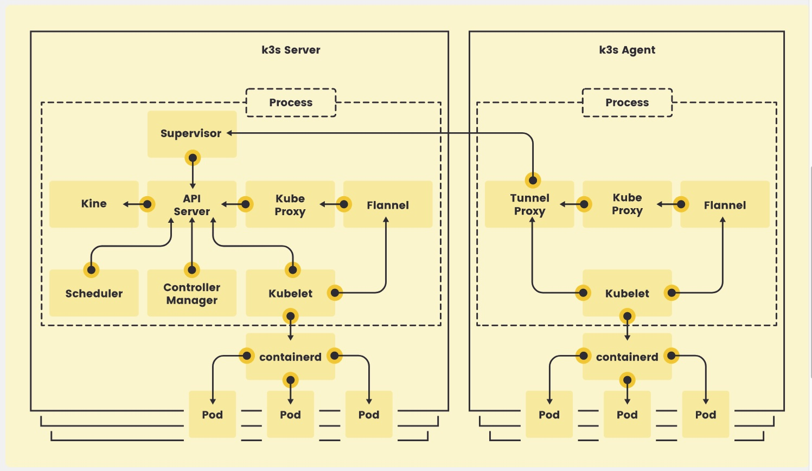
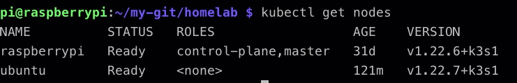

# My K3s Cluster

## Short description

I chose to install k3s due to the light weight and its excellent performance on an ARM processor.
At the beginning my architecture was nothing more than a cluster with a single node, then I added another node.

In the current configuration my cluster has one node based on ARM architecture and one based on AMD64. The heterogeneity of the nodes will allow me to run docker images based on different architectures. 

## Why k3s?

The answer is simple. I wanted to avoid virtual machines (Minikube) or to run Kubernetes in Docker (Kind) and I wanted to practice something that came as close as possible to a real production environment. So K3s!

No, I don't really think about using a K8S cluster in the Cloud, the configuration I currently have would cost me a hundred euros for the same hardware. If I had moved to the cloud, the nature of homelab would have been lost 

## Architecture




## Installing K3s on your node

You can follow the [official documentation](https://rancher.com/docs/k3s/latest/en/quick-start/)

Here are the main commands:

- Install K3s for master node: ```curl -sfL https://get.k3s.io | sh -```
- Install k3s for worker node: ```curl -sfL https://get.k3s.io | K3S_URL=https://myserver:6443 K3S_TOKEN=mynodetoken sh -``` . Replace **myserver** with your master's IP and **mynodetoken** with token that you will find by throwing ```sudo cat /var/lib/rancher/k3s/server/node-token```

If the previous steps were successful, you should receive this output:



## Installing Kubernetes Dashboard

If you want to have an interface to interact with your cluster you can install a handy dashboard.

```kubectl apply -f https://raw.githubusercontent.com/kubernetes/dashboard/v2.0.0-beta8/aio/deploy/recommended.yaml```

You will need a token to log in. You can retrieve it with :

```sudo k3s kubectl -n kubernetes-dashboard describe secret admin-user-token | grep '^token'```

Now all that remains is a ```kubectl proxy &``` (& to run processs in background)

And at this link http://localhost:8001/api/v1/namespaces/kubernetes-dashboard/services/https:kubernetes-dashboard:/proxy/#/login you will find the login screen.

Enter your token and welcome to the kubernetes dashboard!
