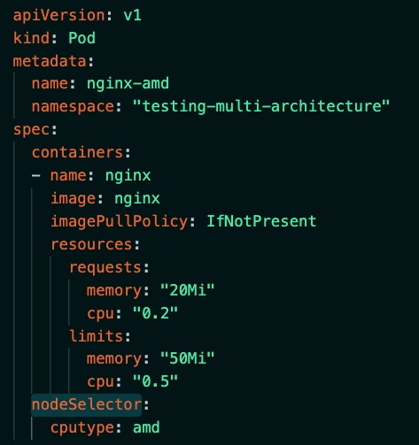
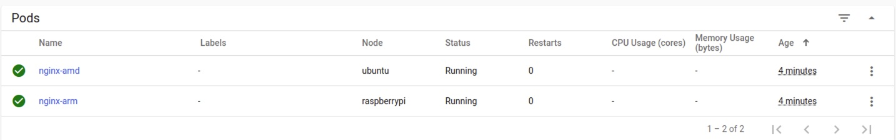
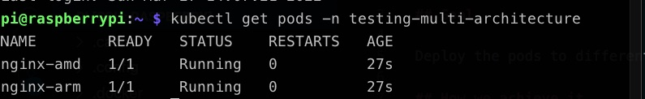

# Article

## Goal

Deploy the pods to different nodes based on the architecture of the docker image they use 

## How we achieve it

We assign a label to each node:

```kubectl label nodes **nodename** cputype=amd```

```kubectl label nodes **nodename** cputype=arm```

Then we use **nodeSelector** in kubernetes manifest:



We can now take a look at our dashboards for information on pods 




or we can check the same information using kubectl

