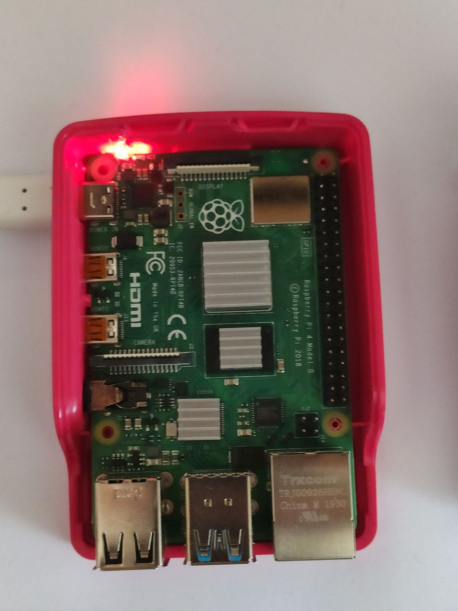
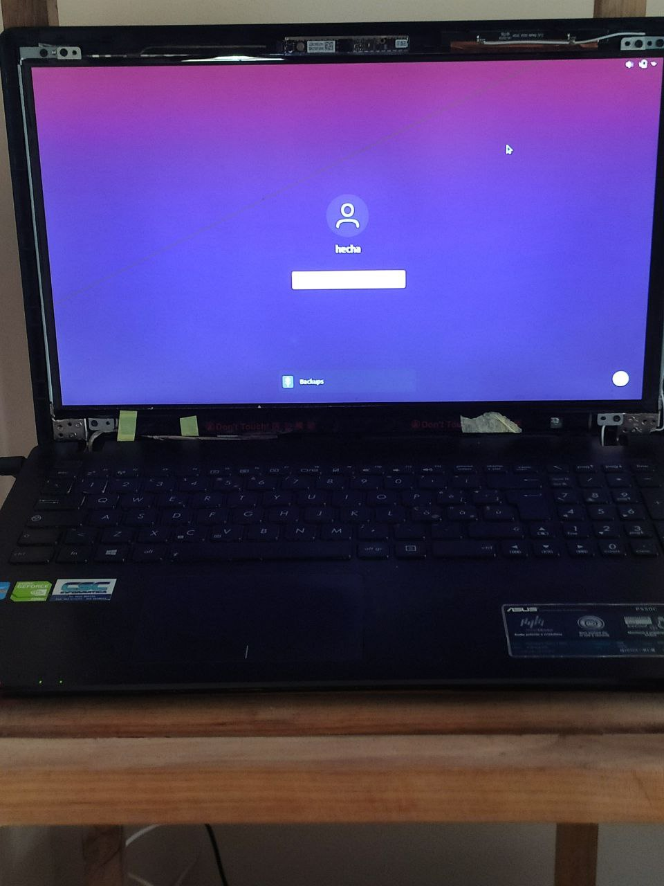

# Homelab & Learning

Hello everyone!

I will use this space to share with you what I do in my home lab.
I hope that someone with a higher seniority than mine can give me advice on what can be improved and things you can add and to create new connections with people who have the same passions as me.

## Index
- [What do i have available](#what-do-i-have-available)
- [Monitoring](#monitoring)
- [Architecture Overview](#test)
- [External Access](#test)

## What do I have available

### RaspberryPi 4

I recently bought a second-hand Raspberry Pi (The prices of these toys have skyrocketed lately due to supply chain problems).
It's a 4 GB RAM.
OS: Raspbian for ARM 64

Isn't it very tender?

### Asus P550C

To get a little more computing power, I also used an old computer, a veteran.
He accompanied me throughout my university career and now we will do another piece of travel together.
This is an Asus P550C, third generation i5 and 4GB of RAM.
It will be useful for doing things that you can't **yet** do on an ARM architecture
OS: Ubuntu Desktop 21.10

After 7 years it's still on track

